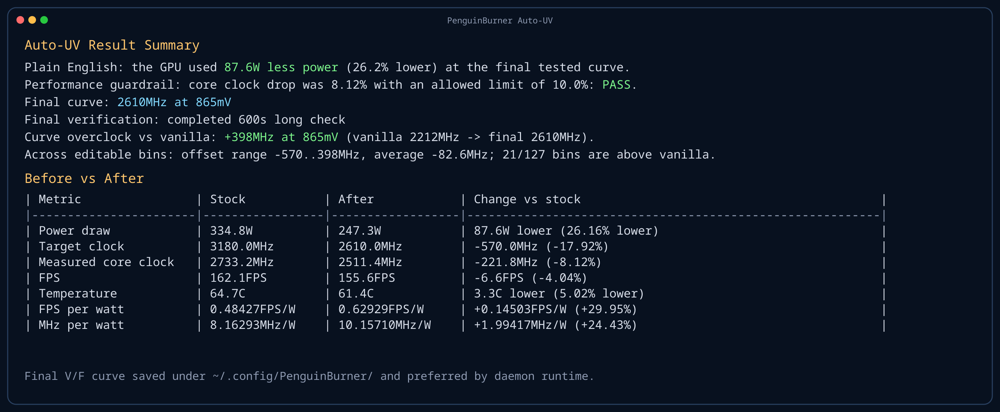

# 🐧 PenguinBurner 🔥

PenguinBurner is a Linux NVIDIA undervolting tool. The main mode is **Auto-UV**:
PenguinBurner tests your GPU under load, finds a stable undervolt, and saves it
for normal foreground or daemon runtime. MSI Afterburner import is still
available as an optional fallback path.

## Auto-UV Quick Start

You do not need an MSI Afterburner profile. On a clean first run, start
PenguinBurner with no arguments:

```bash
sudo ./penguin_burner.sh
```

If no saved Auto-UV curve exists, PenguinBurner automatically starts the
foreground Auto-UV scan. Keep it in the foreground while it searches; this is
intentional because it is testing voltage stability.

To clear old Auto-UV results and start fresh:

```bash
sudo ./penguin_burner.sh --fresh-auto-uv-scan
```



Example Auto-UV result summary: before/after power draw, core clock, and efficiency shown after the final verification.

What Auto-UV does:

1. Reset previous GPU tuning so the scan starts from the driver/default curve.
2. Install the managed Q2RTX test workload automatically if it is missing. Q2RTX uses the freely available Quake II shareware timedemo with NVIDIA's Vulkan ray tracing renderer.
3. Measure the stock loaded behavior: clock, voltage, power, temperature, fan speed, and FPS/W.
4. Pick a safe target core clock and start lowering voltage one real V/F bin at a time.
5. Test each candidate with Q2RTX plus CUDA load.
6. If a candidate only misses the loaded-clock floor, retry that same voltage with a bounded curve target bump. The total bump budget defaults to half of `--auto-uv-max-clock-drop-pct`; each retry spends only the measured clock shortfall plus one small clock step.
7. Accept a candidate only if it stays stable, keeps enough loaded core clock,
   keeps FPS within a `10%` floor of the previous stable probe, and does not
   collapse into idle or low-load telemetry.
8. Keep scanning lower while power/efficiency still makes sense; stop when lower voltage no longer helps, a guardrail fails, or an unsafe point is reached.
9. Run a final long verification, `600s` by default. If that long check fails, Auto-UV backs off to a safer voltage/curve and reruns the long verification; the final result is published only after the long verification completes.
10. Return the GPU to the driver/default curve before the foreground scan exits. The saved curve is applied later by runtime or daemon mode.

By default Auto-UV allows up to a `10%` loaded GPU core clock drop while
searching. To use a looser `12%` clock-drop allowance:

```bash
sudo ./penguin_burner.sh --auto-uv-max-clock-drop-pct 12
```

Undervolting can hang the GPU, crash the driver, freeze the display, or force a
reboot. If the system crashes during an Auto-UV probe, PenguinBurner records the
in-progress voltage as unsafe on the next run and will not test that voltage or
lower voltages again unless you deliberately clear Auto-UV state.

After the scan, daemonize normal runtime:

```bash
sudo ./penguin_burner.sh --daemonize
```

By default runtime applies the saved V/F curve and leaves fan control to the GPU
driver. To opt into the saved Auto-UV fan curve too:

```bash
sudo ./penguin_burner.sh --daemonize --silent-fan-curve
```

Saved Auto-UV files are written under PenguinBurner's user config directory:

- final V/F curve
- suggested fan curve
- debug logs

More details: [Auto-UV quick guide](docs/auto-uv.md).

If you already have a known-good MSI Afterburner profile, you can still
preview/import it with:

```bash
./penguin_burner.sh --dry-run --afterburner-dir "$AFTERBURNER_ROOT"
```


Example dry-run preview: imported V/F target and fan curve rendered directly in the terminal before any GPU changes are applied.

PenguinBurner is experimental NVIDIA tuning software. It is intended for modern
Linux NVIDIA drivers, but GPU generation and driver behavior can differ.
Requires `nvidia-smi` in `PATH` for the default runtime path, including persistence mode, power-limit setup, and some Afterburner profile auto-selection.
Reverse engineering, profile parsing, and import support were developed against MSI Afterburner `4.6.6.16757`.
Other MSI Afterburner versions are not guaranteed to work.

## Runtime Requirements

- `python3` must be available in `PATH`, `3.11+` is required
- no third-party Python packages are required; PenguinBurner uses only the Python standard library
- NVIDIA driver libraries such as `libnvidia-ml.so.1` and `libnvidia-api.so.1` are required at runtime, but they come from the NVIDIA driver
- `nvidia-smi` must be available in `PATH`

## Python Package

PenguinBurner can also be installed as a Python package once a release is
published to PyPI:

```bash
python -m pip install penguin-burner
```

That installs the `penguin-burner` and `penguin_burner` console commands. The
PyPI package name uses the correct spelling: `penguin-burner`.

## Quality Checks

Current local release checks:

- `pytest`: 38 mocked tests for Auto-UV logic, Afterburner parsing, and Q2RTX helpers
- `ruff check .` and `ruff format --check .`
- `pyright .`
- Python syntax compile for all project `.py` files
- `shellcheck` for shell scripts
- local `sdist` and wheel build with `python -m build --no-isolation`

## Acknowledgements

Special thanks to the LACT project and to Ilya Zlobintsev for pushing Linux NVIDIA tuning forward.

While PenguinBurner was still reverse engineering proprietary NVIDIA binaries and had only working voltage getters, LACT landed a working custom voltage/frequency point setter first. In particular, LACT pull request [`#957`](https://github.com/ilya-zlobintsev/LACT/pull/957), `feat: add Nvidia VF curve editor`, was merged on April 18, 2026.

If any part of PenguinBurner's MSI Afterburner profile parsing or import logic is useful to LACT, feel free to borrow it.

## Proprietary inputs are not bundled

This repository does not ship MSI Afterburner binaries or copied profile exports.

If you want to import Afterburner data, point PenguinBurner at the real MSI
Afterburner directory from Windows. By default that directory is:

- `C:\Program Files (x86)\MSI Afterburner`

On Linux, `--afterburner-dir` should point at that same directory through a
mounted Windows drive or a copied directory tree. PenguinBurner expects this
layout under that root:

- `MSIAfterburner.cfg`
- `Profiles/*.cfg`

or set `PENGUIN_BURNER_AFTERBURNER_ROOT` to another directory with that layout.

## CLI Options

Auto-UV does not require an MSI Afterburner profile. If no final Auto-UV curve
exists yet and no usable Afterburner import exists, running with no arguments
starts the foreground scan:

```bash
sudo ./penguin_burner.sh
```

The explicit scan command is also available:

```bash
sudo ./penguin_burner.sh --auto-uv-voltage-scan
```

### Auto-UV Options

- `--auto-uv-voltage-scan`: start the foreground Auto-UV voltage scan explicitly.
- `--fresh-auto-uv-scan`: clear previous Auto-UV scan state and immediately start a new foreground scan.
- `--clear-auto-uv-state`: clear previous Auto-UV scan state and exit.
- `--install-q2rtx`: download the managed Q2RTX workload without starting a scan.
- `--auto-uv-final-seconds N`: final verification duration after the best curve is selected; default `600`.
- `--auto-uv-max-clock-drop-pct N`: maximum loaded core-clock drop allowed during scan; default `10.0`.
- `--auto-uv-clock-bump-budget-ratio N`: fraction of `--auto-uv-max-clock-drop-pct` available as total clock-bump budget; default `0.5`, clamped to `0.0..1.0`.
- `--auto-uv-max-drop-pct N`: maximum voltage drop below the first discovered start voltage; default `18.0`.
- `--auto-uv-efficiency-stop-streak N`: extra lower-voltage confirmation probes after FPS/W stops improving; default `1`, use `0` to disable.
- `--auto-uv-min-efficiency-stop-drop-pct N`: minimum voltage drop below scan start before FPS/W no-gain can stop the scan; default `10.0`.
- `--stability-test`: run the Q2RTX plus CUDA stability workload directly and exit.
- `--stability-seconds N`: duration for `--stability-test`; default `600`.
- `--stability-width N` and `--stability-height N`: Q2RTX render size; defaults `2560x1440`.
- `--show-q2rtx-window`: show the Q2RTX window instead of using hidden/headless mode.
- `--stability-log-dir PATH`: write `--stability-test` logs to a specific directory.

#### Auto-UV Aggressiveness Tuning

The most important Auto-UV tuning knobs are the loaded-clock drop allowance and
the clock-bump budget ratio.

- `--auto-uv-max-clock-drop-pct N` controls how much loaded core clock Auto-UV
  may sacrifice while lowering voltage. The default `10.0` means the scan may
  accept loaded clocks down to about `90%` of the initial measured loaded clock.
  Lower values preserve more performance; higher values search deeper.
- `--auto-uv-clock-bump-budget-ratio N` controls how much of that clock-drop
  allowance Auto-UV may spend trying to recover clock with curve-target bumps.
  The default `0.5` means half of the clock-drop allowance is available as total
  bump budget. `0` disables bump recovery; values above `1.0` are clamped.
- `--auto-uv-max-drop-pct N` caps the voltage search depth below the first
  discovered start voltage. Lower values stop voltage search earlier; higher
  values allow deeper undervolting.
- `--auto-uv-efficiency-stop-streak N` controls how many extra lower-voltage
  no-gain confirmations are required after temperature-normalized FPS/W stops
  improving. Higher values probe longer before accepting the FPS/W wall.
- `--auto-uv-min-efficiency-stop-drop-pct N` prevents FPS/W no-gain from ending
  the scan until the requested voltage has dropped far enough from the start
  voltage.
- `--auto-uv-final-seconds N` controls final verification confidence. Shorter
  runs finish faster; longer runs are more trustworthy.

With the default `10%` clock-drop allowance:

- `--auto-uv-clock-bump-budget-ratio 0.25` gives up to `+2.5%` total bump budget.
- `--auto-uv-clock-bump-budget-ratio 0.5` gives up to `+5%` total bump budget.
- `--auto-uv-clock-bump-budget-ratio 0.75` gives up to `+7.5%` total bump budget.
- `--auto-uv-clock-bump-budget-ratio 1.0` gives up to `+10%` total bump budget.

Conservative profile:

```bash
sudo ./penguin_burner.sh --auto-uv-voltage-scan \
  --auto-uv-max-clock-drop-pct 8 \
  --auto-uv-clock-bump-budget-ratio 0.25 \
  --auto-uv-max-drop-pct 14
```

Balanced profile:

```bash
sudo ./penguin_burner.sh --auto-uv-voltage-scan \
  --auto-uv-max-clock-drop-pct 10 \
  --auto-uv-clock-bump-budget-ratio 0.5
```

Aggressive profile:

```bash
sudo ./penguin_burner.sh --auto-uv-voltage-scan \
  --auto-uv-max-clock-drop-pct 14 \
  --auto-uv-clock-bump-budget-ratio 0.75 \
  --auto-uv-max-drop-pct 20
```

Example: use a looser `12%` core-clock drop allowance during Auto-UV:

```bash
sudo ./penguin_burner.sh --auto-uv-voltage-scan --auto-uv-max-clock-drop-pct 12
```

### Afterburner Import Options

- `--dry-run`: preview imported Afterburner V/F and fan curves without applying them.
- `--afterburner-dir PATH`: path to the MSI Afterburner directory.
- `--section NAME`: choose a saved Afterburner profile section, such as `Profile1`.
- `--afterburner-device-profile PATH`: choose the exact Afterburner `Profiles/*.cfg` device file.
- `--power-limit-override-w N`: cap the translated Afterburner power target in watts.
- `--preserve-vf-below-mv N`: keep the stock Linux V/F curve at this voltage and below while importing the tuned curve above it.
- `--dangerously-skip-validation`: bypass normal Afterburner profile validation; advanced use only.
- `--restore-defaults-from-config`: apply the imported Afterburner `Defaults` V/F curve and GPU policy, then exit.

Example dry run:

```bash
./penguin_burner.sh --dry-run --afterburner-dir "$AFTERBURNER_ROOT"
```

### Runtime And Daemon Options

- `--daemonize`: start PenguinBurner as a transient `systemd` service.
- `--foreground`: run the normal runtime in the foreground.
- `--install-systemd-service`: install the boot-time systemd service.
- `--uninstall-systemd-service`: remove the boot-time systemd service.
- `--silent-fan-curve`: opt into PenguinBurner manual fan-curve control during runtime/daemon mode.
- `--prefer-afterburner-curve`: prefer the imported Afterburner V/F curve over the saved Auto-UV curve during runtime/daemon mode.
- `--config PATH`: use a specific runtime config path.
- `--gpu-index N`: select a specific NVIDIA GPU.
- `--debug-log`: write a verbose diagnostic log for the current operation.
- `--journal-hours N`: change the suggested `journalctl --since` window shown after daemonizing.

Default Afterburner profile validation:

- PenguinBurner only auto-selects saved non-default manual V/F presets.
- By default, the selected preset must contain a flattened tail that can be turned into a lock point.
- That flattened lock point must be a real undervolt versus `Defaults` or `Startup` at the same clock, with at least `5mV` of margin.
- If no saved preset passes those checks, PenguinBurner stops instead of guessing.
- `--dangerously-skip-validation` bypasses the flat-tail and undervolt-margin checks and widens selection back to any saved manual preset.
- This override is for advanced cases where you intentionally want a non-undervolt or otherwise unusual curve. It does not make the imported curve safe.

## Runtime launch

- Use `penguin_burner.sh` as the single user entrypoint. It resolves the repo path itself, so you do not need to `cd` into the repository first.
- Running `penguin_burner.sh` directly stays in the foreground by default.
- On a clean first run, `sudo ./penguin_burner.sh` starts Auto-UV automatically. After a final Auto-UV curve exists, the same command runs normal foreground runtime using that saved curve.
- The checked-in `PenguinBurner.service` file is only an example. The preferred path is `sudo ./penguin_burner.sh --install-systemd-service`, which writes a unit with the real absolute script path for the current checkout.
- On the first interactive run with a newly configured Afterburner root, PenguinBurner automatically imports that root into its managed config, runs a dry-run preview, then prompts you to continue in foreground mode or daemonize later.
- `--dry-run` is the recommended first step. It parses the selected Afterburner root directory, prints concise summaries, and draws console charts for the V/F curve and fan curve without attempting GPU writes. It does not require sudo.
- `--dangerously-skip-validation` can be combined with `--dry-run` when you want to inspect an unusual saved curve before allowing any GPU writes.
- `--debug-log` can be combined with `--dry-run`, a first-time import, or foreground runtime testing when you need the full profile-discovery and parsing trail for an incompatible or otherwise unexpected MSI Afterburner export.
- the extra debug payload is written to the debug log file only; it does not spam stdout in foreground mode and it does not add extra noise to the `systemd` journal
- Actual runtime control and any real V/F, power-limit, persistence-mode, or optional fan changes should be treated as privileged operations and run with `sudo`.
- Normal runtime and daemon mode do not control fans unless `--silent-fan-curve` is present.
- Use `--daemonize` only when you explicitly want PenguinBurner to launch as a transient `systemd` service.
- Use `--install-systemd-service` only when you explicitly want a persistent boot-time `systemd` service.
- Use `--uninstall-systemd-service` to remove that persistent service again.
- If `systemd` is unavailable, `--daemonize` exits with a clear error instead of pretending to background itself.
- In foreground mode, logs go to stdout.
- In daemonized mode, logs go to the `systemd` journal, not to a hardcoded file in the repository.
- `--journal-hours N` changes the suggested `journalctl --since` window shown after daemonizing. The default view window is `4` hours.
- Use `--foreground` only to force the current process path if you are already wrapping PenguinBurner in another launcher.

Examples:

```bash
sudo ./penguin_burner.sh
```

```bash
sudo ./penguin_burner.sh --daemonize
```

```bash
sudo ./penguin_burner.sh --daemonize --silent-fan-curve
```

```bash
sudo ./penguin_burner.sh --install-systemd-service
```

```bash
./penguin_burner.sh --dry-run --afterburner-dir "$AFTERBURNER_ROOT"
```

```bash
./penguin_burner.sh --install-q2rtx
./penguin_burner.sh --stability-test --stability-seconds 600
```

```bash
sudo journalctl -u PenguinBurner.service --since "-4 hours" -f
```

## Q2RTX Stability Test

`--stability-test` runs a non-interactive Q2RTX timedemo workload and then exits.
It is intentionally isolated from the normal fan-control runtime path.

What it does:

- uses fixed `2560x1440` render settings by default to keep the workload GPU-bound
- uses `gamescope --backend headless` by default when available, which gives Q2RTX a real nested Vulkan target without a visible desktop window
- falls back to moving the real Vulkan window off-screen when gamescope is unavailable; pass `--show-q2rtx-window` if you want to see it
- disables V-Sync and dynamic resolution scaling, pins the dynamic-resolution min/max scale to `100%`, disables FSR upscaling, leaves the render loop uncapped, and keeps sound off
- forces heavy real-time RTX features on, including `pt_num_bounce_rays=2`, `pt_reflect_refract=8`, `pt_thick_glass=2`, `pt_caustics=1`, bloom, volumetric lighting, and the particle/beam/sprite paths
- runs one short timedemo calibration pass, then repeats the built-in timedemo workload for the requested wall-clock duration
- prefers a ready-made `q2demo1` timedemo from `pak0.pak` when shareware data is installed
- parses each timedemo pass for exact `frames / seconds / fps` metrics
- compares frame counts and FPS run-to-run so obvious regressions or unstable performance show up quickly
- polls lightweight NVIDIA telemetry with `nvidia-smi`
- records the Q2RTX stdout/stderr log to a file
- marks the run as failed if a pass exits early, if timedemo metrics are missing, if frame counts drift, if FPS drops too far run-to-run, if fatal output patterns appear, or if NVIDIA Xid messages are detected after launch

### Headless Q2RTX

By default, Auto-UV and `--stability-test` try to run Q2RTX without showing a
desktop window. PenguinBurner does this by launching Q2RTX inside:

```text
gamescope --backend headless
```

This is not a fake low-resolution render. Q2RTX still creates a real Vulkan
render target at the configured size, so the GPU workload remains useful for
undervolt testing. The difference is that the window belongs to gamescope's
private headless compositor, not to KDE, GNOME, X11, or Wayland on your desktop.

If `gamescope` is not installed or cannot start, PenguinBurner falls back to a
best-effort off-screen X11 window. That fallback may still be visible on some
Wayland desktops because the compositor can clamp windows to the visible
desktop.

To force a normal visible Q2RTX window for debugging:

```bash
sudo ./penguin_burner.sh --auto-uv-voltage-scan --show-q2rtx-window
```

What it does not do yet:

- it does not verify rendered pixels or detect subtle visual corruption
- it does not score image quality or compare frame hashes
- it is currently a practical "did repeated heavy timedemo passes complete with sane FPS behavior and without obvious driver faults" check

If Q2RTX is not installed yet, run `./penguin_burner.sh --install-q2rtx`. That downloads the latest official Linux tar.gz from the NVIDIA GitHub releases into PenguinBurner's managed user cache/data directories, which PenguinBurner auto-detects first. The Auto-UV path also performs this install automatically when the managed Q2RTX install is missing, printing the lookup, download, extraction, and runtime-library progress to stdout. The current official Linux tarball already includes the freely available Quake II shareware data, NVIDIA's Vulkan ray tracing renderer, and the ready-made `q2demo1` timedemo.

By default PenguinBurner auto-selects a ready-made timedemo, first looking for demos on disk and then inside `pak0.pak`, preferring demos like `q2demo1`.

## Auto-UV Voltage Scan

Auto-UV is foreground-only while scanning. Start it, let it finish, then
daemonize normal runtime.

```bash
sudo ./penguin_burner.sh
```

The scan resets old clock offsets, measures real loaded behavior, tests lower
voltages one by one, and writes a final curve only after verification. It also
remembers unsafe voltages so a later run does not repeat a bad point.

After the scan, run normal runtime:

```bash
sudo ./penguin_burner.sh --daemonize
```

If you also want PenguinBurner to apply the saved fan curve during runtime:

```bash
sudo ./penguin_burner.sh --daemonize --silent-fan-curve
```

Detailed user guide: [Auto-UV quick guide](docs/auto-uv.md).

To clear previous Auto-UV run history and start from scratch:

```bash
sudo ./penguin_burner.sh --fresh-auto-uv-scan
```

## Dry Run First

`--dry-run` is intended for experimentation. It is the safest way to verify that
PenguinBurner is parsing the right MSI Afterburner directory before you let it
touch live GPU state.

What dry-run shows:

- the selected Afterburner root, device profile, and section
- a compact V/F summary in `MHz` and `mV`
- an ASCII V/F chart with `mV` on the x-axis and `MHz` on the y-axis, overlaying target `#` against stock/base `.`, with lock point `@`
- an ASCII fan chart with temperature on the x-axis and fan percent on the y-axis
- translated power-limit and memory-offset previews

What dry-run does not do:

- it does not enable persistence mode
- it does not set power limits
- it does not write V/F offsets
- it does not take over fan control

Suggested workflow:

1. Run `--dry-run` until the preview matches what you expect.
2. Try different saved sections, device profiles, or a different preserve threshold if needed.
3. Only then run the real foreground or `systemd` path with `sudo`.

If parsing fails, import behaves unexpectedly, or the wrong Afterburner profile is being selected, re-run with
`--debug-log`. That writes a timestamped file under
`debug-logs/` next to the selected config file; with the default config that is
the selected config file under `debug-logs/`. The log includes the discovered device
profiles, per-section validation results, raw section key dumps, V/F blob and
fan-curve blob metadata, per-point Linux V/F translation details, chosen fan
profile, foreground runtime diagnostics, and traceback details for parsing errors.

If something does not work with your MSI Afterburner export, please open an issue at:

- `https://github.com/jpietek/PenguinBurner/issues`

Attach the full debug log file or files, not just a pasted excerpt. That makes it much
easier to improve PenguinBurner for new profile variants and parsing failures.

If you have a useful bug fix, parser improvement, documentation cleanup, or any
other improvement that makes PenguinBurner work better, pull requests are
welcome too.

Examples:

```bash
./penguin_burner.sh --dry-run --afterburner-dir "$AFTERBURNER_ROOT"
```

```bash
./penguin_burner.sh --dry-run --afterburner-dir "$AFTERBURNER_ROOT" --section <saved-section>
```

```bash
./penguin_burner.sh --dry-run --afterburner-dir "$AFTERBURNER_ROOT" --preserve-vf-below-mv 800
```

```bash
./penguin_burner.sh --dry-run --afterburner-dir "$AFTERBURNER_ROOT" --section <saved-section> --dangerously-skip-validation
```

```bash
./penguin_burner.sh --dry-run --afterburner-dir "$AFTERBURNER_ROOT" --debug-log
```

## Log fields

Example status line:

```text
temp=...C fan=...%/...% power=...W gpu_clock=...MHz mem_clock=...MHz voltage=...mV clk_ceiling=...->...MHz@...mV mem_vf_offset=...MHz vf_point=...MHz@...mV vf_offset=...MHz vf_vanilla=...MHz@...mV uv=...mV fan_curve_state=hardware-auto next_fan_step=...C->...% fan_mode=auto
```

This example is the hardware-auto case. Without `--silent-fan-curve`, normal runtime lines include `fan_control=disabled` and PenguinBurner does not write fan speeds. Once PenguinBurner takes over the fans with `--silent-fan-curve`, steady-state lines switch to `fan_mode=manual` and also include `target`, `curve`, and `hyst`.

Some fields are conditional and only appear when the related policy or telemetry path is active.

- `temp`: current GPU temperature.
- `fan`: current reported fan speed for each fan, in percent.
- `power`: current board power draw in watts.
- `gpu_clock`: current graphics clock.
- `mem_clock`: current memory clock.
- `voltage`: current GPU voltage telemetry.
- `clk_ceiling`: the intended flattened V/F curve point, shown as `requested->applied`, with `@voltage` when present.
- `mem_vf_offset`: applied global memory V/F offset in MHz. This is an offset control, not the live memory clock reading.
- `vf_point`: current matched core V/F point from the live V/F table, shown as `clock@voltage`.
- `vf_offset`: current offset applied at that matched core V/F point. This is a curve-local MHz offset, not a direct undervolt value in mV.
- `vf_vanilla`: stock/base core V/F point used as the comparison reference.
- `uv`: voltage delta versus `vf_vanilla`; a negative value means the current matched point is below the stock reference voltage.
- `fan_curve_state`: current fan-control state. `hardware-auto` means the GPU's own automatic fan control still owns the fans; other lines can show the active manual curve segment or `emergency-auto`.
- `next_fan_step`: next fan-curve transition PenguinBurner is waiting for, shown as `temp->speed`, or `resume-custom`/`none` when that is the next action.
- `fan_control`: appears as `disabled` when PenguinBurner is intentionally leaving fans to the hardware/driver.
- `fan_mode`: overall fan-control mode for the current line when `--silent-fan-curve` is active. `auto` means the GPU's own automatic fan control still owns the fans. `manual` means PenguinBurner is actively setting fan speed. Transition/event lines such as entering or restoring manual mode may log an `event=` field instead of `fan_mode`.

## Run At Your Own Risk

Dry-run is encouraged. Real hardware changes are not.

Once you leave `--dry-run`, PenguinBurner can perform operations such as:

- enabling persistence mode
- setting board power limits
- writing core V/F offsets
- writing memory V/F offsets
- taking over fan control, but only when `--silent-fan-curve` is used

Those paths can hang the GPU, crash the driver, freeze the display, or require a
reboot. Treat them as experimental tuning operations.

Auto-UV intentionally runs in the foreground while scanning because it is testing
crash-prone voltage points. During each risky voltage probe it writes an
active-probe marker and removes it during normal cleanup, including Ctrl-C and
SIGTERM. If the machine hangs, reboots, loses power, or the process is forcibly
killed during a probe, restart PenguinBurner normally. The stale marker is
treated as an abrupt previous probe end, that voltage is marked unsafe, and
future scans avoid that voltage and lower voltages unless Auto-UV state is
cleared.

For actual fan or V/F curve changes, use `sudo`. If the preview is not exactly what you want, go back to `--dry-run` and keep iterating there.

`--dangerously-skip-validation` only removes the saved-profile validation gate. It does not make an unusual or aggressive curve safe to apply.
