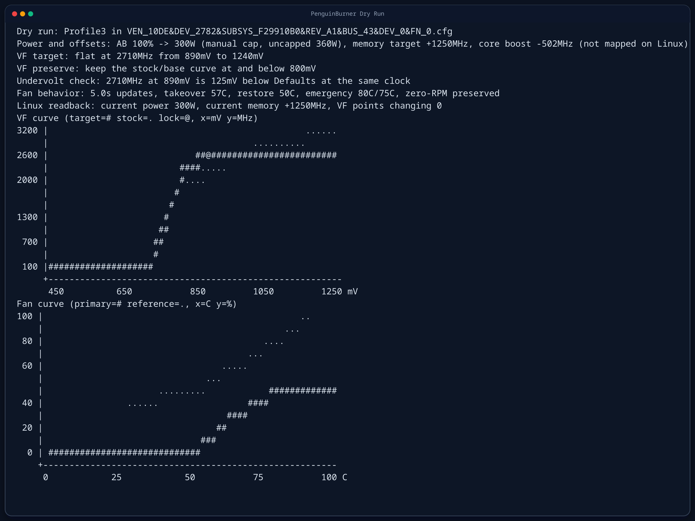

# 🐧 PenguinBurner 🔥

PenguinBurner is the missing link for running MSI Afterburner fan control and undervolt setups on Linux.

Quick start: preview an MSI Afterburner export with `./penguin_burner.sh --dry-run --afterburner-dir '/mnt/windows/Program Files (x86)/MSI Afterburner'`. If the preview looks right, run the real foreground path with `sudo ./penguin_burner.sh`. You can also install it as a `systemd` service later; see [Runtime launch](#runtime-launch).



Example dry-run preview: imported V/F target and fan curve rendered directly in the terminal before any GPU changes are applied.

Tested on an RTX 5080 with NVIDIA 595+ drivers. RTX 40-series is likely to work on modern Linux drivers. RTX 30-series is still unconfirmed.
Requires `nvidia-smi` in `PATH` for the default runtime path, including persistence mode, power-limit setup, and some Afterburner profile auto-selection.
Reverse engineering, profile parsing, and import support were developed against MSI Afterburner `4.6.6.16757`.
Other MSI Afterburner versions are not guaranteed to work.

## Runtime Requirements

- `python3` must be available in `PATH`
- Python `3.11+` is required
- no third-party Python packages are required; PenguinBurner uses only the Python standard library
- NVIDIA driver libraries such as `libnvidia-ml.so.1` and `libnvidia-api.so.1` are required at runtime, but they come from the NVIDIA driver, not from `pip`
- `nvidia-smi` must be available in `PATH`

## Acknowledgements

Special thanks to the LACT project and to Ilya Zlobintsev for pushing Linux NVIDIA tuning forward.

While PenguinBurner was still reverse engineering proprietary NVIDIA binaries and had only working voltage getters, LACT landed a working custom voltage/frequency point setter first. In particular, LACT pull request [`#957`](https://github.com/ilya-zlobintsev/LACT/pull/957), `feat: add Nvidia VF curve editor`, was merged on April 18, 2026.

If any part of PenguinBurner's MSI Afterburner profile parsing or import logic is useful to LACT, feel free to borrow it.

## What is in the main path

- `penguin_burner.sh`: main user entrypoint
- `penguin_burner.py`: runtime daemon
- `PenguinBurner.service`: example static `systemd` unit; the installer path is still preferred
- `import_afterburner_fan_curve.py`: fan-curve importer
- `import_afterburner_vf_curve.py`: V/F and policy importer
- `afterburner_fan_curve.py`: Afterburner fan parser
- `afterburner_vfcurve.py`: Afterburner V/F parser and translation logic
- `hidden_nvapi_vf.py`: hidden Linux NVAPI V/F access
- `hidden_nvml_voltage.py`: hidden voltage telemetry helper
- `nvml_gpu_policy.py`: public NVML policy and clock helpers

## Proprietary inputs are not bundled

This repository does not ship MSI Afterburner binaries or copied profile exports.

If you want to import Afterburner data, point PenguinBurner at the real MSI
Afterburner directory from Windows. By default that directory is:

- `C:\Program Files (x86)\MSI Afterburner`

From Linux, `--afterburner-dir` or `afterburner_root` should point at that same
directory through a mounted Windows drive or a copied directory tree. PenguinBurner
expects this layout under that root:

- `<homedir>/.config/PenguinBurner/afterburner-profiles/MSIAfterburner.cfg`
- `<homedir>/.config/PenguinBurner/afterburner-profiles/Profiles/*.cfg`

or set `PENGUIN_BURNER_AFTERBURNER_ROOT` to another directory with that layout.

## Generated data

Translated Linux V/F profiles are generated under:

- `<homedir>/.config/PenguinBurner/linux-vf-profiles/`

Runtime config is stored under:

- `<homedir>/.config/PenguinBurner/penguin_burner.toml`

Afterburner import defaults also live under:

- `<homedir>/.config/PenguinBurner/afterburner-profiles/`

None of this runtime data is stored in the repository by default.

## Config

Mandatory:

- `afterburner_root`

Only needed in specific cases:

- `afterburner_profile`: selects the saved Afterburner section such as `Profile3` when multiple non-default V/F presets exist
- `afterburner_device_profile`: selects the exact `Profiles/*.cfg` device file when auto-selection is not the one you want
- `afterburner_power_limit_override_w`: manually caps the translated Afterburner power target in watts after the percentage is converted
- `afterburner_preserve_vanilla_below_mv`: keeps the stock/base Linux V/F curve at and below an inclusive voltage threshold while still importing the tuned part above it
- `afterburner_dangerously_skip_validation`: bypasses the normal flat-tail and undervolt checks for profile selection so an unusual saved manual preset can still be imported; advanced and not recommended as a default

On first interactive run, PenguinBurner prompts for the MSI Afterburner root
directory if it is not already saved in the config. This means the real
Afterburner install directory from Windows, usually
`C:\Program Files (x86)\MSI Afterburner`.

CLI equivalents:

- `afterburner_root` -> `--afterburner-dir`
- `afterburner_profile` -> `--section`
- `afterburner_device_profile` -> `--afterburner-device-profile`
- `afterburner_power_limit_override_w` -> `--power-limit-override-w`
- `afterburner_preserve_vanilla_below_mv` -> `--preserve-vf-below-mv`
- `afterburner_dangerously_skip_validation` -> `--dangerously-skip-validation`

Other runtime flags:

- `--config`: read a different runtime config instead of `<homedir>/.config/PenguinBurner/penguin_burner.toml`
- `--gpu-index`: target a different NVIDIA GPU when more than one is present
- `--journal-hours N`: change the suggested `journalctl --since` window shown after daemonizing
- `--debug-log`: write a verbose dry-run, first-import, or foreground-runtime diagnostic log next to the selected config file under `debug-logs/`; with the default config this is `<homedir>/.config/PenguinBurner/debug-logs/`

Low-voltage preserve option:

- `afterburner_preserve_vanilla_below_mv` and `--preserve-vf-below-mv` are inclusive. For example, `800` means PenguinBurner keeps the stock/base curve at `800mV` and below.
- This is mainly a low-voltage and idle-behavior safeguard. On this test setup, frequent curve edits in Afterburner eventually disturbed frequency/voltage scaling in idle.
- Preserving the stock curve below a threshold is the workaround for that case: the low-voltage region stays vanilla, while the imported undervolt or flattened target still applies above the threshold.

Default Afterburner profile validation:

- PenguinBurner only auto-selects saved non-default manual V/F presets.
- By default, the selected preset must contain a flattened tail that can be turned into a lock point.
- That flattened lock point must be a real undervolt versus `Defaults` or `Startup` at the same clock, with at least `5mV` of margin.
- If no saved preset passes those checks, PenguinBurner stops instead of guessing.
- `afterburner_dangerously_skip_validation` and `--dangerously-skip-validation` bypass the flat-tail and undervolt-margin checks and widen selection back to any saved manual preset.
- This override is for advanced cases where you intentionally want a non-undervolt or otherwise unusual curve. It does not make the imported curve safe.

## Runtime launch

- Use `penguin_burner.sh` as the single user entrypoint. It resolves the repo path itself, so you do not need to `cd` into the repository first.
- Running `penguin_burner.sh` directly stays in the foreground by default.
- The checked-in `PenguinBurner.service` file is only an example. The preferred path is `sudo ./penguin_burner.sh --install-systemd-service`, which writes a unit with the real absolute script path for the current checkout.
- On the first interactive run with a newly configured Afterburner root, PenguinBurner automatically imports that root into its managed config, runs a dry-run preview, then prompts you to continue in foreground mode or daemonize later.
- `--dry-run` is the recommended first step. It parses the selected Afterburner root directory, prints concise summaries, and draws console charts for the V/F curve and fan curve without attempting GPU writes.
- `--dry-run` does not require `sudo`.
- `--dangerously-skip-validation` can be combined with `--dry-run` when you want to inspect an unusual saved curve before allowing any GPU writes.
- `--debug-log` can be combined with `--dry-run`, a first-time import, or foreground runtime testing when you need the full profile-discovery and parsing trail for an incompatible or otherwise unexpected MSI Afterburner export.
- the extra debug payload is written to the debug log file only; it does not spam stdout in foreground mode and it does not add extra noise to the `systemd` journal
- Actual runtime control and any real fan, V/F, power-limit, or persistence-mode changes should be treated as privileged operations and run with `sudo`.
- Use `--daemonize` only when you explicitly want PenguinBurner to launch as a transient `systemd` service.
- Use `--install-systemd-service` only when you explicitly want a persistent boot-time `systemd` service.
- Use `--uninstall-systemd-service` to remove that persistent service again.
- If `systemd` is unavailable, `--daemonize` exits with a clear error instead of pretending to background itself.
- In foreground mode, logs go to stdout.
- In daemonized mode, logs go to the `systemd` journal, not to a hardcoded file in the repository.
- `--journal-hours N` changes the suggested `journalctl --since` window shown after daemonizing. The default view window is `4` hours.
- Use `--foreground` only to force the current process path if you are already wrapping PenguinBurner in another launcher.

Examples:

```bash
sudo ./penguin_burner.sh
```

```bash
sudo ./penguin_burner.sh --daemonize
```

```bash
sudo ./penguin_burner.sh --install-systemd-service
```

```bash
./penguin_burner.sh --dry-run --afterburner-dir '/mnt/windows/Program Files (x86)/MSI Afterburner'
```

```bash
sudo journalctl -u PenguinBurner.service --since "-4 hours" -f
```

## Dry Run First

`--dry-run` is intended for experimentation. It is the safest way to verify that
PenguinBurner is parsing the right MSI Afterburner directory before you let it
touch live GPU state.

What dry-run shows:

- the selected Afterburner root, device profile, and section
- a compact V/F summary in `MHz` and `mV`
- an ASCII V/F chart with `mV` on the x-axis and `MHz` on the y-axis, overlaying target `#` against stock/base `.`, with lock point `@`
- an ASCII fan chart with temperature on the x-axis and fan percent on the y-axis
- translated power-limit and memory-offset previews
- optional Linux readback context when available

What dry-run does not do:

- it does not enable persistence mode
- it does not set power limits
- it does not write V/F offsets
- it does not take over fan control

Suggested workflow:

1. Run `--dry-run` until the preview matches what you expect.
2. Try different saved sections, device profiles, or a different preserve threshold if needed.
3. Only then run the real foreground or `systemd` path with `sudo`.

If parsing fails, import behaves unexpectedly, or the wrong Afterburner profile is being selected, re-run with
`--debug-log`. That writes a timestamped file under
`debug-logs/` next to the selected config file; with the default config that is
`<homedir>/.config/PenguinBurner/debug-logs/`. The log includes the discovered device
profiles, per-section validation results, raw section key dumps, V/F blob and
fan-curve blob metadata, per-point Linux V/F translation details, chosen fan
profile, foreground runtime diagnostics, and traceback details for parsing errors.
The debug file is capped at roughly `700KB` so it stays shareable.

If something does not work with your MSI Afterburner export, please open an issue at:

- `https://github.com/jpietek/PenguinBurner/issues`

Attach the full debug log file or files, not just a pasted excerpt. That makes it much
easier to improve PenguinBurner for new profile variants and parsing failures.

If you have a useful bug fix, parser improvement, documentation cleanup, or any
other improvement that makes PenguinBurner work better, pull requests are
welcome too.

Examples:

```bash
./penguin_burner.sh --dry-run --afterburner-dir '/mnt/windows/Program Files (x86)/MSI Afterburner'
```

```bash
./penguin_burner.sh --dry-run --afterburner-dir '/mnt/windows/Program Files (x86)/MSI Afterburner' --section Profile3
```

```bash
./penguin_burner.sh --dry-run --afterburner-dir '/mnt/windows/Program Files (x86)/MSI Afterburner' --preserve-vf-below-mv 800
```

```bash
./penguin_burner.sh --dry-run --afterburner-dir '/mnt/windows/Program Files (x86)/MSI Afterburner' --section Profile3 --dangerously-skip-validation
```

```bash
./penguin_burner.sh --dry-run --afterburner-dir '/mnt/windows/Program Files (x86)/MSI Afterburner' --debug-log
```

## Log fields

Example status line:

```text
temp=40.0C fan=0%/0% power=21.00W gpu_clock=1237MHz mem_clock=15626MHz voltage=800mV clk_ceiling=2710->2707MHz@890mV mem_vf_offset=+1250MHz vf_point=1192MHz@725mV vf_offset=+1466MHz vf_vanilla=1177MHz@770mV uv=-45mV fan_curve_state=hardware-auto next_fan_step=57C->30% fan_mode=auto
```

This example is the hardware-auto case. Once PenguinBurner takes over the fans, steady-state lines switch to `fan_mode=manual` and also include `target`, `curve`, and `hyst`.

Some fields are conditional and only appear when the related policy or telemetry path is active.

- `temp`: current GPU temperature.
- `fan`: current reported fan speed for each fan, in percent.
- `power`: current board power draw in watts.
- `gpu_clock`: current graphics clock.
- `mem_clock`: current memory clock.
- `voltage`: current GPU voltage telemetry.
- `clk_ceiling`: the intended flattened V/F curve point, shown as `requested->applied`, with `@voltage` when present.
- `mem_vf_offset`: applied global memory V/F offset in MHz. This is an offset control, not the live memory clock reading.
- `vf_point`: current matched core V/F point from the live V/F table, shown as `clock@voltage`.
- `vf_offset`: current offset applied at that matched core V/F point. This is a curve-local MHz offset, not a direct undervolt value in mV.
- `vf_vanilla`: stock/base core V/F point used as the comparison reference.
- `uv`: voltage delta versus `vf_vanilla`; a negative value means the current matched point is below the stock reference voltage.
- `fan_curve_state`: current fan-control state. `hardware-auto` means the GPU's own automatic fan control still owns the fans; other lines can show the active manual curve segment or `emergency-auto`.
- `next_fan_step`: next fan-curve transition PenguinBurner is waiting for, shown as `temp->speed`, or `resume-custom`/`none` when that is the next action.
- `fan_mode`: overall fan-control mode for the current line. `auto` means the GPU's own automatic fan control still owns the fans. `manual` means PenguinBurner is actively setting fan speed. Transition/event lines such as entering or restoring manual mode may log an `event=` field instead of `fan_mode`.

## Run At Your Own Risk

Dry-run is encouraged. Real hardware changes are not.

Once you leave `--dry-run`, PenguinBurner can perform operations such as:

- enabling persistence mode
- setting board power limits
- writing core V/F offsets
- writing memory V/F offsets
- taking over fan control

Those paths can hang the GPU, crash the driver, or require a reboot. Treat them as experimental tuning operations.

For actual fan or V/F curve changes, use `sudo`. If the preview is not exactly what you want, go back to `--dry-run` and keep iterating there.

`--dangerously-skip-validation` only removes the saved-profile validation gate. It does not make an unusual or aggressive curve safe to apply.
