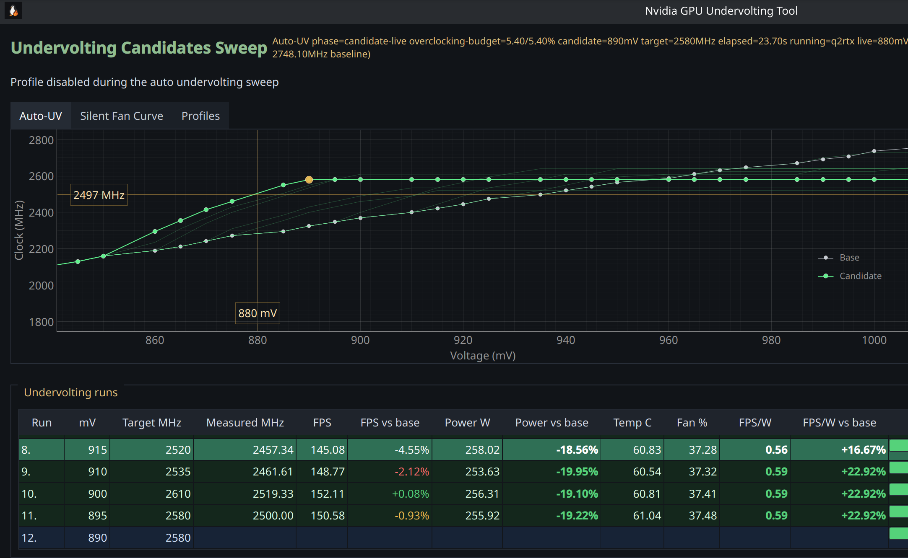
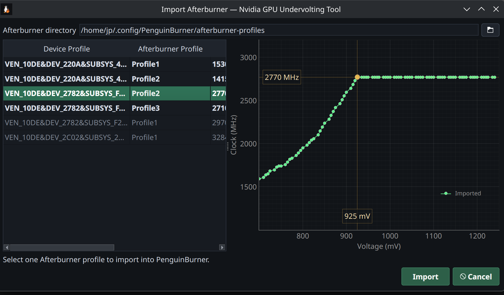
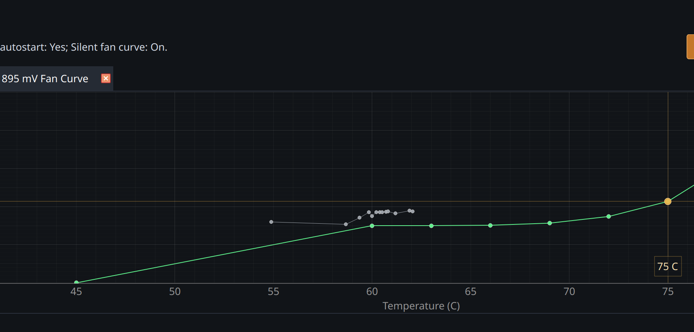

<p align="center">
  
</p>

# Penguin Burner - Nvidia GPU Undervolting Tool

**PenguinBurner** is the **Nvidia GPU Undervolting** Tool. It is the ultimate NVIDIA undervolting companion on Linux. Its main feature is **automatic** GPU undervolting: PenguinBurner tests your GPU under gaming and compute load, finds the most efficient stable undervolt, and can save it as a systemd daemon when you decide to apply it.

PenguinBurner is proven to work on modern Linux systems with the **NVIDIA proprietary** graphics driver. For best results, use a up to date driver. Supported GPUs are NVIDIA GeForce RTX 50 series Blackwell cards and, potentially, RTX 40 series Ada Lovelace cards. Older GPUs may miss required driver-level voltage/frequency control functionality.

GPU undervolting is meant to make your graphics card consume significantly less power while giving up as little performance as possible. The practical result can be **dead-silent fan** operation, **lower temperatures**, and lower electricity bills. PenguinBurner automatically searches for the operating sweet spot of your NVIDIA GPU, so you do not have to resort to trial and error or risk introducing avoidable system instability.

## Install

Install the published package:

```bash
python -m pip install --user --upgrade penguin-burner
```

Bundled pip entrypoints:

- GUI: `penguin-burner` - alias: `pburn`
- CLI/non-GUI: `penguin-burner-cli` - alias: `pburn-cli`

The pip package also provides a desktop file, so PenguinBurner should appear with its icon in your desktop environment's app launcher.

If your shell cannot find the commands after installation, make sure `~/.local/bin` is in your `PATH`.

## Automatic Undervolting

Core PenguinBurner component in action: algorithmic Auto Undervolting with built-in performance and stability checks based on a path-tracing gaming scenario, **Q2RTX**, and a custom **CUDA** compute test.



## MSI Afterburner Import

Feel at home and import your MSI Afterburner profile from Windows.



## Silent Fan Curve

Apply a silent fan curve after PenguinBurner finds a stable undervolt.



## LACT Export

Export to the LACT Linux GPU control tool is available from the profiles view.

## Proprietary Inputs Are Not Bundled

This repository does not ship MSI Afterburner binaries or copied profile exports.

If you want to import Afterburner data, point PenguinBurner at the real MSI Afterburner directory from Windows. By default that directory is:

```text
C:\Program Files (x86)\MSI Afterburner
```

## Acknowledgements

Special thanks to the [LACT project](https://github.com/ilya-zlobintsev/LACT) and to Ilya Zlobintsev for pushing Linux NVIDIA tuning forward.

While PenguinBurner was still reverse engineering proprietary NVIDIA binaries and had only working voltage getters, LACT landed a working custom voltage/frequency point setter first. In particular, [LACT pull request #957, feat: add Nvidia VF curve editor](https://github.com/ilya-zlobintsev/LACT/pull/957), was merged on April 18, 2026.

## Run At Your Own Risk

Real hardware changes are made during the Auto UV procedure.

PenguinBurner can perform operations such as:

- enabling persistence mode
- setting board power limits
- writing core V/F offsets
- writing memory V/F offsets
- taking over fan control

## Support

If you like the tool, please consider supporting the project on GitHub:

https://github.com/sponsors/jpietek

Having issues with PenguinBurner? Please report bugs here:

https://github.com/jpietek/PenguinBurner/issues

## CLI Documentation

The previous CLI-focused README has been archived here:

[readme-cli.md](readme-cli.md)
