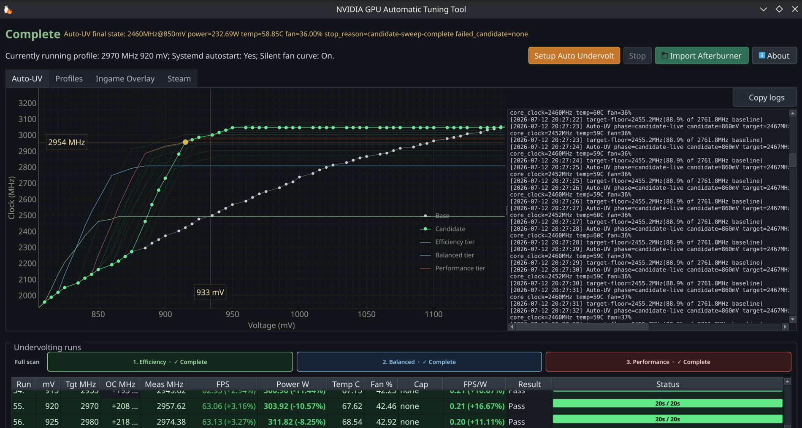
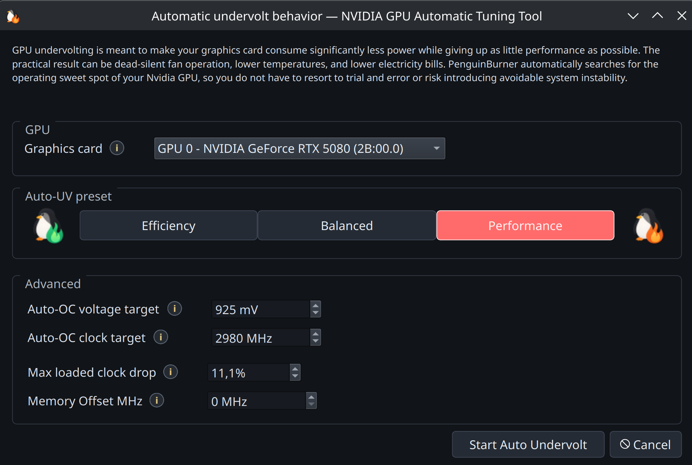
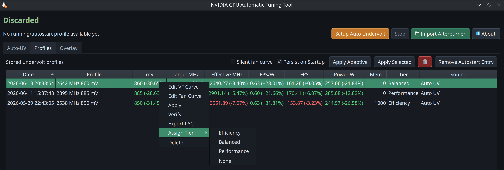
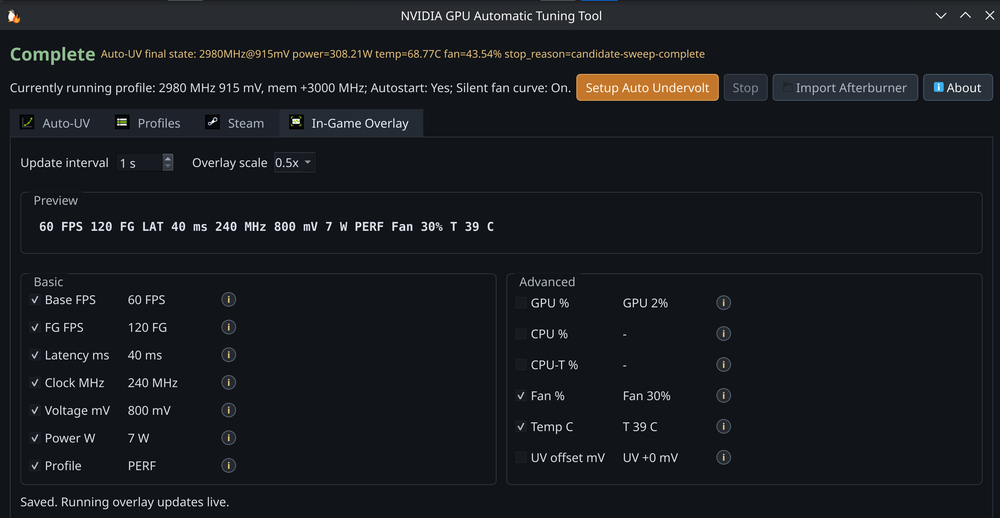
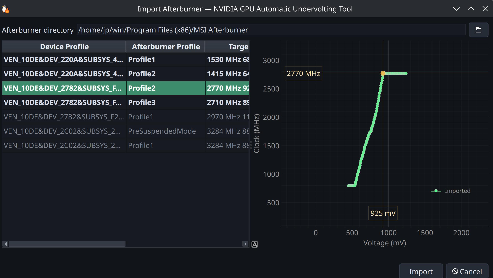

#  NVIDIA GPU Auto Tuning Linux Tool

<p align="center">
  <a href="https://pypi.org/project/penguin-burner/"></a>
  <a href="https://pypi.org/project/penguin-burner/"></a>
  
  <a href="LICENSE"></a>
  
  <a href="https://github.com/sponsors/jpietek"></a>
  <a href="https://github.com/jpietek/PenguinBurner/stargazers"></a>
</p>
<p align="center">
  
  
  
  
  <a href="https://pepy.tech/project/penguin-burner"></a>
</p>

**PenguinBurner tunes your NVIDIA GPU on Linux, starting with
automatic and adaptive undervolting, plus an optional in-game monitoring overlay
with a PC latency meter and pre-frame-generation FPS that updates live.**

You get quieter fans, lower temperatures, and lower power draw, with no manual
trial and error. It tests your card under real load, finds a stable efficient
setting, and can switch settings automatically as your frame rate changes.

Works on the NVIDIA proprietary driver with RTX 50 (Blackwell), RTX 40 (Ada),
and RTX 30 (Ampere) cards. A recent driver is recommended.

The goal is an all-in-one package for NVIDIA on Linux that is easy to install
and use, closing the feature gap with the Windows tools Linux users miss: the
[NVIDIA App](https://www.nvidia.com/en-us/software/nvidia-app/), NVUV, and
[MSI Afterburner](https://www.msi.com/Landing/afterburner/graphics-cards).

## Install

```bash
python -m pip install --user --upgrade penguin-burner
```

Or install the self-hosted Flatpak:

```bash
flatpak remote-add --user --if-not-exists penguinburner https://jpietek.github.io/PenguinBurner/penguin-burner.flatpakrepo && flatpak install --user -y penguinburner io.github.jpietek.PenguinBurner && flatpak run --user --command=penguin-burner-install-wrappers io.github.jpietek.PenguinBurner
```

That single command installs the Flatpak and host command wrappers. After that,
`penguin-burner`, `pburn`, `penguin-burner-ui`, `pburn-ui`,
`penguin-burner-cli`, `pburn-cli`, and `PENGUIN_BURNER` work from your `PATH`
just like the native packages. It also registers the native Vulkan overlay layer
for your user account, so Steam launch options can stay short. The wrapper
installer refuses to overwrite existing native/PyPI commands unless rerun with
`--force`.

Existing Flatpak users should update and refresh the PATH wrappers with:

```bash
flatpak update --user -y io.github.jpietek.PenguinBurner && flatpak run --user --command=penguin-burner-install-wrappers io.github.jpietek.PenguinBurner
```

To uninstall the Flatpak cleanly, remove the host wrappers before removing the
app. The wrapper cleanup removes only files created by the wrapper installer,
including the `~/.local/bin` commands and the user Vulkan layer manifest. It
does not remove your regular PenguinBurner config or Auto-UV profiles under
`~/.config/PenguinBurner`, so those stay available to PyPI/native installs.

```bash
flatpak run --user --command=penguin-burner-install-wrappers io.github.jpietek.PenguinBurner --uninstall
flatpak uninstall --user --delete-data io.github.jpietek.PenguinBurner
flatpak remote-delete --user penguinburner
```

You can also launch the Flatpak directly without wrappers:

```bash
flatpak run io.github.jpietek.PenguinBurner
```

Also packaged for [Fedora (COPR)](https://copr.fedorainfracloud.org/coprs/jpietek/penguin-burner/),
[Arch / CachyOS (AUR)](https://aur.archlinux.org/packages/penguin-burner), and
[Ubuntu (PPA)](https://launchpad.net/~jpietek/+archive/ubuntu/penguin-burner) —
commands in the [Install guide](docs/install.md).

PyPI, Flatpak with wrappers, COPR, AUR, and PPA installs run the GUI with
`penguin-burner` (or `pburn`). Install the NVIDIA driver and CUDA first.

## Quick start

1. Install (above) with the NVIDIA driver and CUDA already set up.
2. Launch PenguinBurner (`penguin-burner` or `pburn`; Flatpak without wrappers:
   `flatpak run io.github.jpietek.PenguinBurner`).
3. Click **Setup Auto Undervolt**, choose a performance bias, and let the scan
   find and verify a stable curve.
4. On the **Profiles** tab, select the result and click **Apply Selected**.
   Toggle **Silent fan curve** for the quiet fan profile.
5. Enable **Persist on Startup** to apply it at boot, or **Apply Adaptive** to
   switch tiers as your frame rate changes.

## Automatic Tuning

Tests your card under real load and finds the most efficient stable undervolt
curve for you. The sweep runs PenguinBurner's managed
[headless Q2RTX benchmark](https://github.com/jpietek/Q2RTX-headless)
plus a **CUDA** compute test, with stability and performance checks built in.
If a scan crashes mid-probe, the next run records that voltage/clock band as
unsafe and can resume from saved candidates for the same tier.

During Auto-UV, leave the GPU otherwise idle. Do not run games, renders,
machine-learning jobs, video encoders, miners, or other GPU/VF/VRAM-heavy work
while the scan is progressing. Auto-UV needs the whole card to itself so its
FPS-per-watt and stability measurements reflect the candidate curve, not a
second workload competing for power, clocks, memory bandwidth, or VRAM.



Pick a bias (Efficiency, Balanced, or Performance) and it finds the matching
sweet spot, then verifies it before saving.
You can also set a GPU board power limit for the scan; PenguinBurner reads the
selected card's NVML power-limit range, applies the cap during Auto-UV, and
saves it with the final profile so runtime/profile application restores it.



[Read the guide](docs/features/auto-uv.md)

## Adaptive Undervolting

Tag your saved profiles as **Efficiency**, **Balanced**, or **Performance**, and
PenguinBurner switches between them while you play: efficient and silent when you
have headroom, more clock when frames start to drop.



[Read the guide](docs/features/adaptive-uv.md)

## PenguinBurner vs LACT (NVIDIA)

[LACT](https://github.com/ilya-zlobintsev/LACT) is the broader, more established
Linux GPU app, and it landed a working Nvidia VF curve setter before we did. It
supports more brands and has deeper monitoring than we do. PenguinBurner is
narrower on purpose: automatic undervolting, an in-game overlay, and adaptive
switching. NVIDIA-only comparison, to the best of our knowledge:

| Capability (NVIDIA) | PenguinBurner | LACT |
| --- | :---: | :---: |
| **Automatic** undervolt search (stability + perf verified) | ✅ Q2RTX + CUDA sweep | ❌ manual only |
| **Adaptive** undervolt (switches tiers by frame rate) | ✅ | ❌ |
| **In-game performance overlay** | ✅ | ❌ |
| **PC latency meter** | ✅ | ❌ |
| **Pre-frame-generation FPS counter** (base vs FG FPS) | ✅ | ❌ |
| Manual V/F curve editor | ✅ | ✅ |
| Fan curve control | ✅ auto silent curve + editor | ✅ custom curves |
| Power limit | ✅ Auto-UV + saved profiles | ✅ |
| Steam library import | 🚧 planned | ❌ |
| Per-game tuning profiles | 🚧 planned | ❌ |
| Runtime profile switching | ✅ by present-frame FPS pacing | ✅ by running process / gamemode |
| MSI Afterburner import | ✅ | ❌ |
| Historical telemetry charts | 🚧 planned (live overlay today) | ✅ charts + CSV export |
| Detailed GPU info (VBIOS / VRAM / Vulkan / throttling) | ❌ tuning-focused | ✅ |
| Other GPU brands (AMD / Intel) | ❌ NVIDIA-native, for now | ✅ AMD · Intel · NVIDIA |
| systemd daemon · CLI / headless | ✅ · ✅ | ✅ · ✅ |

✅ available · ❌ not available · 🚧 planned/in progress

LACT monitors inside its own window (charts and CSV) and has no in-game overlay;
on Linux that is usually a separate tool like MangoHud. PenguinBurner's overlay
is built in.

The two interoperate via LACT export, so you can tune with PenguinBurner and run
the resulting curve under LACT if you prefer.

### Roadmap (planned, not yet shipped)

- **Historical data plotting** — power, clocks, and FPS over time.
- **Steam library discovery** — find installed games automatically.
- **Per-game tuning** — save and auto-apply a profile per game.

## Performance Overlay

A lightweight live on-screen readout over your game. It can visualize **PC
latency** and **pre-frame-generation FPS** — things most Linux overlays can't —
alongside frame-gen FPS, clocks, voltage, power, temperatures, and the active
tier.



Launch the game through the wrapper, then toggle the fields you want:

```text
PENGUIN_BURNER %command%
```

Add the overlay flag when you want the readout visible immediately:

```text
PB_OVERLAY=1 PENGUIN_BURNER %command%
```

Native Vulkan markers are the default latency source. For games whose latency
markers only reach dxvk-nvapi, opt in explicitly:

```text
PB_INGAME_LATENCY=1 PENGUIN_BURNER %command%
```

PenguinBurner auto-detects patched dxvk-nvapi/Proton nvapi builds and uses
`DXVK_NVAPI_LATENCY_MARKER_LOG=1`, which emits marker-only records instead of
full trace. With stock dxvk-nvapi it falls back to `DXVK_NVAPI_LOG_LEVEL=trace`,
but only for games launched with `PB_INGAME_LATENCY=1`; the main runtime handles
the data path without a separate helper service.

Some games do not expose usable latency markers at all. PenguinBurner can load
the telemetry layer and parse marker streams when they exist, but it cannot
force a game engine to emit real input/simulation/present markers. See
[Latency and frame-generation FPS](docs/features/latency-fg.md) for the full
source and fallback model.

Any tuning change you make is reflected live in the overlay while you play, so
you see the effect of an undervolt, clock, or fan change in real time without
leaving the game.

If you want the detailed numbers behind that LAT figure, start the daemon with
`PENGUIN_BURNER_DUMP_LATENCY_DATA=1` in its environment. It dumps the full
per-frame latency breakdown — present mode, queue depth, Reflex sleep-mode/boost,
and the display/scanout split — to the daemon log, which you can capture to a
file by also passing `--debug-log`.

[Read the guide](docs/features/overlay.md) or the
[latency/FG details](docs/features/latency-fg.md).

## More features

- **[Profile management](docs/features/profile-management.md)** — apply, verify,
  tier, export, and clean up saved curves.
- **[Curve editors](docs/features/curve-editor.md)** — Afterburner-style manual
  V/F and fan curve editors with full keyboard control.
- **[Silent fan curve](docs/features/silent-fan-curve.md)** — auto-generated
  quiet fan curve once the undervolt brings temperatures down.

## MSI Afterburner Import

Bring your Windows [MSI Afterburner](https://www.msi.com/Landing/afterburner/graphics-cards)
profile over and import its V/F curve.



Point PenguinBurner at the real MSI Afterburner directory (no Afterburner
binaries or profiles are bundled in this repo). Default Windows path:

```text
C:\Program Files (x86)\MSI Afterburner
```

## LACT Export

Export any saved V/F (and optionally fan) curve as a complete Nvidia LACT config
from the Profiles view. See
[the Auto-UV guide](docs/features/auto-uv.md#after-the-scan) for the workflow.

## Run At Your Own Risk

Auto-UV makes real hardware changes — enabling persistence mode, setting board
power limits, writing core/memory V/F offsets, and taking over fan control.

The **Balanced** and **Efficiency** Auto-UV profiles are ultra-defensive.
Balanced at most retains the card's stock clock, probing gently for lower
voltage. Efficiency just follows the stock curve on the first pass — lowering
power consumption by reducing clock — then undervolts only very slightly.

**Performance** undervolt mode is the one that pushes past stock. On my RTX 5080,
during the OC phase I sometimes get a "Vulkan device lost", which PenguinBurner
catches and then reverts the problematic voltage/frequency point. Worst case is
a hard system freeze and reboot — after which the blacklisted V/F point is
persisted to the UV history file in your home directory, so it is not retried.

You can also define, in the Performance UV dialog, exactly which
voltage/frequency point the card is pushed to over stock limits. The default is
the suggested point for 30/40/50-tier GPUs, based on experiments with this and
similar tools on Windows. Performance is optional anyway — OC is not mandatory.

## Acknowledgements

PenguinBurner was built through agentic AI development, guided by human ideas and
direction. The implementation, research, and reverse engineering were driven
primarily by **GPT 5.5** (OpenAI) and **Claude Opus** (Anthropic), with brief use
of **Fable** (Anthropic).

- **NVIDIA** — for the graphics technology that, unfortunately, lacks some
  features and polish on Linux.
- **[Qt Project](https://www.qt.io/)** — for the excellent Qt6 UI.

Special thanks to the [LACT project](https://github.com/ilya-zlobintsev/LACT)
and Ilya Zlobintsev for pushing Linux NVIDIA tuning forward — in particular
[LACT #957 (Nvidia VF curve editor)](https://github.com/ilya-zlobintsev/LACT/pull/957),
merged April 18, 2026.

## Support

- [Sponsor the project](https://github.com/sponsors/jpietek)
- [Report a bug](https://github.com/jpietek/PenguinBurner/issues)

## CLI Documentation

The CLI-focused README is archived in [readme-cli.md](readme-cli.md).

## Start clean

Reset PenguinBurner user state for a fresh run:

```bash
rm -rf ~/.config/PenguinBurner ~/.local/share/PenguinBurner ~/.cache/PenguinBurner
```

Installing from a local checkout? See the [Install guide](docs/install.md#local-wheel-from-a-checkout).
