# Auto-UV State Machines

This document describes the Auto-UV main loop after the readable `auto_uv`
rewrite. The legacy `auto_uv` package has been removed after its behavior was
ported into smaller named modules.

## Rendered Diagrams

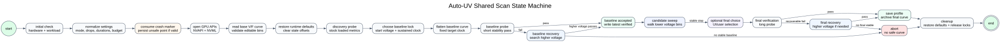

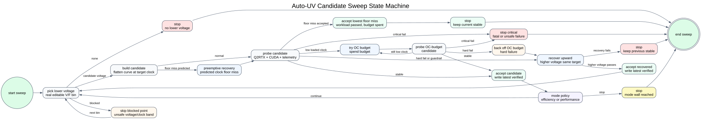

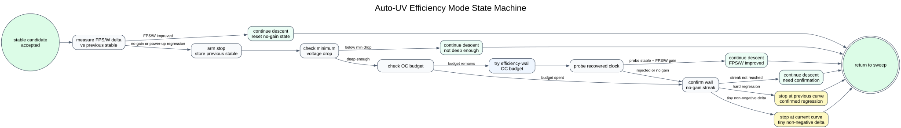

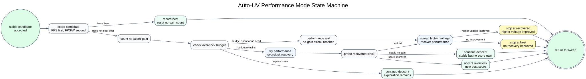

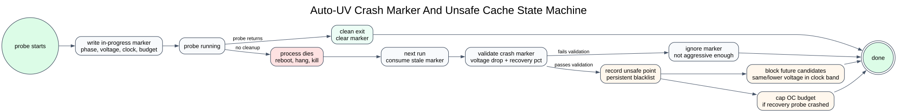

## Big Picture

Auto-UV is a guarded voltage descent:

1. Measure the stock loaded behavior.
2. Flatten the V/F curve at the chosen clock and start voltage.
3. Probe lower real voltage bins.
4. Accept stable candidates and write the latest verified curve.
5. Recover when failures are explainable.
6. Stop before the search becomes unsafe or unproductive.
7. Run final verification and archive the selected profile.

The candidate sweep is mode-specific only after a probe has been accepted.
Efficiency mode asks "did FPS/W stop improving?" Performance mode asks "did the
performance score stop improving?"

## Shared Scan State Machine

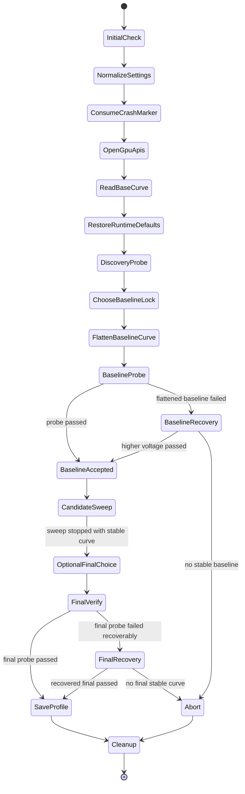

### Shared State Notes

- `InitialCheck` checks that the GPU, driver, Q2RTX setup, and validation policy are usable.
- `NormalizeSettings` resolves mode, max voltage drop, final duration, short probe duration, and OC budget.
- `ConsumeCrashMarker` loads a stale probe marker from the previous run and may add a persistent unsafe entry.
- `ReadBaseCurve` gets editable Linux NVAPI V/F points and validates that the base curve is usable.
- `DiscoveryProbe` measures stock loaded FPS, power, temperature, fan, clock, and voltage.
- `ChooseBaselineLock` chooses the start voltage and sustained loaded clock to preserve.
- `FlattenBaselineCurve` builds the first fixed-clock undervolt curve.
- `BaselineProbe` verifies that the baseline curve is actually stable before descending.
- `CandidateSweep` is the main algorithm loop described below.
- `OptionalFinalChoice` can ask the UI/user to choose among verified candidates.
- `FinalVerify` runs the long verification pass before a profile is archived.
- `Cleanup` restores runtime defaults and releases clock locks even after errors.

## Candidate Sweep State Machine

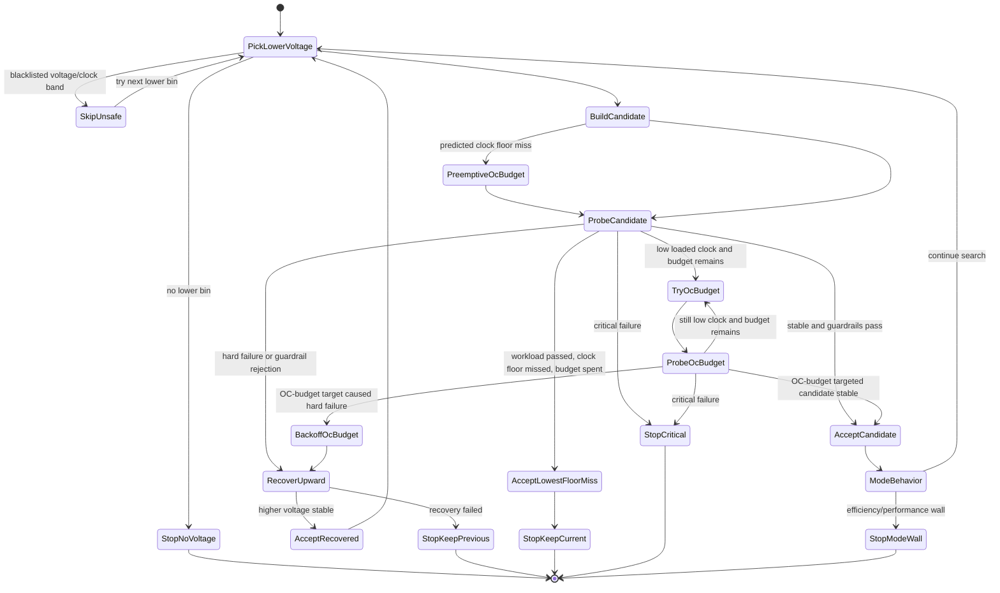

### Candidate Selection Rules

- The next voltage is a lower editable bin from the base V/F curve.
- The default target follows the base curve downward instead of pinning the original clock forever.
- After a stable probe, the next target may use the measured loaded clock, not only the requested target.
- A recent accepted voltage/clock slope can predict that the next lower voltage will miss the clock floor.
- If a floor miss is predicted and budget remains, the candidate can spend OC budget before probing.
- Persistent OC budget carries forward so later lower-voltage probes do not lose recovered clock.
- When full budget is spent, the first full-budget target is fixed for future lower-voltage probes.
- Unsafe cache entries block the failed voltage and lower voltages only in the failed clock band when clock data exists.

## Probe Decision State Machine

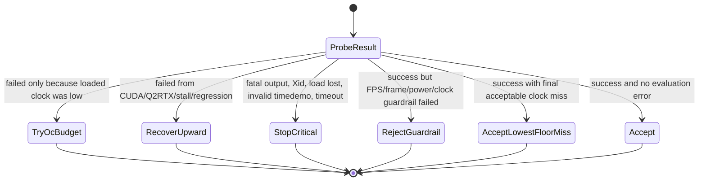

## Efficiency Mode State Machine

Efficiency mode is FPS/W-first. It accepts lower voltage while efficiency
improves, then confirms the efficiency wall before stopping.

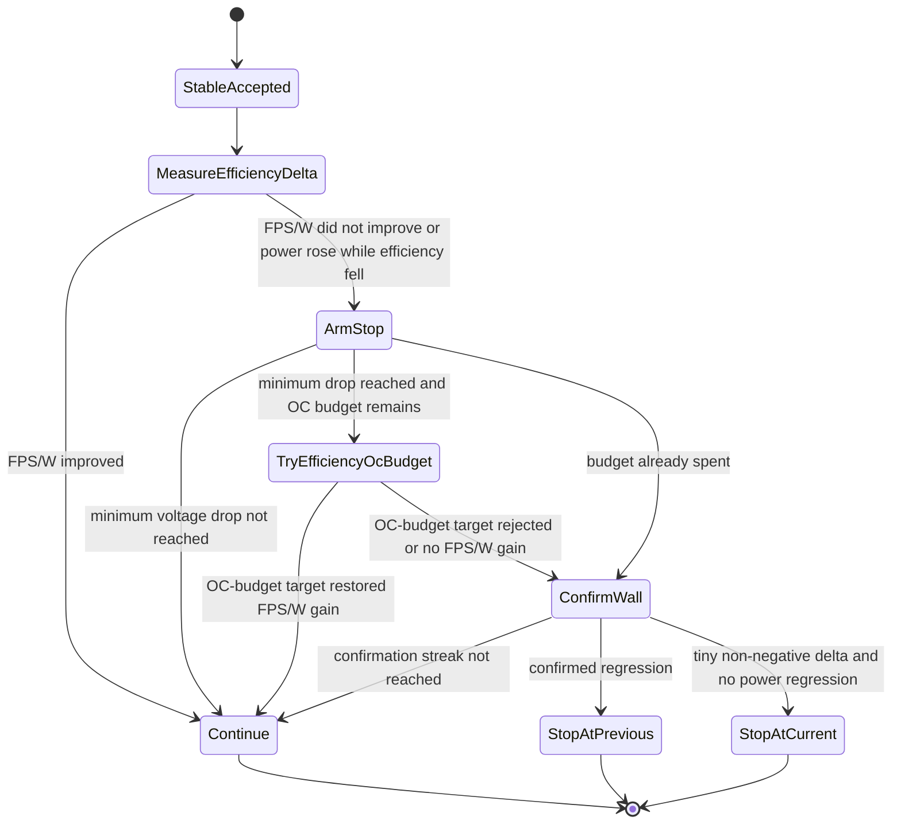

Efficiency mode state:

- `no_gain_streak` counts accepted probes that did not improve FPS/W.
- `pending_stop_candidate` stores the previous stable curve when the wall is first seen.
- `min_efficiency_stop_voltage_drop_pct` prevents stopping too close to the start voltage.
- `efficiency_stop_streak` requires extra confirmation after the first no-gain probe.
- Available OC budget delays the final stop so the algorithm can try to recover lost clock first.

## Performance Mode State Machine

Performance mode still descends voltage, but it scores candidates by FPS first
and FPS/W second. It is allowed to spend more OC budget and can sweep back
up in voltage to recover a better high-performance point.

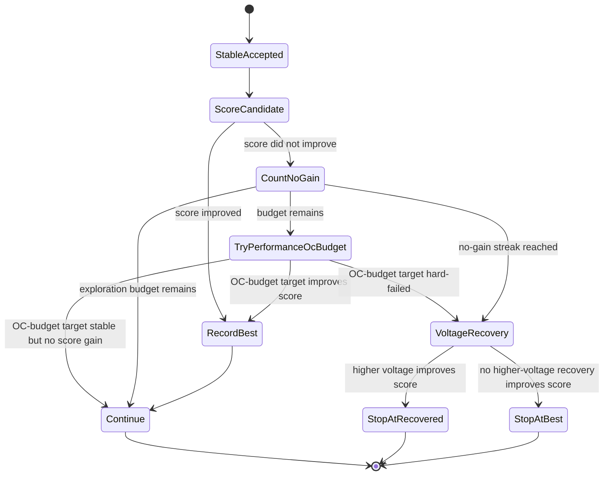

Performance mode state:

- `best_candidate`, `best_probe`, and `best_score` remember the best observed result.
- `no_score_gain_steps` counts accepted probes that did not beat the best score.
- `min_exploration_steps` prevents stopping before enough lower-voltage points are sampled.
- `max_no_score_gain_steps` stops the descent after repeated non-improvements.
- `max_OC-budget target_step_pct` caps one performance recovery jump.
- `max_voltage_recovery_mv` and `max_voltage_recovery_probes` bound the upward voltage sweep.

## Crash And Unsafe Cache State Machine

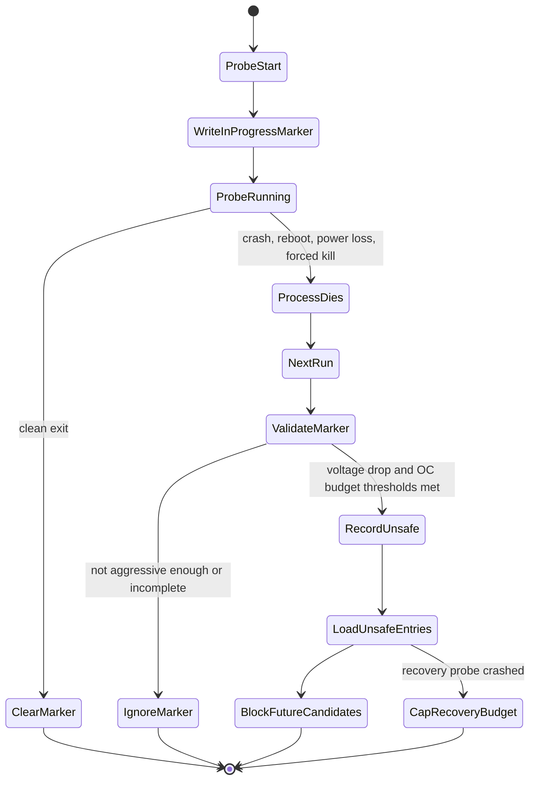

Crash and unsafe rules:

- Candidate, candidate-OC-budget, stabilize, final-OC-budget, and final-verify probes write an in-progress marker.
- Clean probe exit clears the marker.
- A stale marker is treated as a crash only if it passes crash-cache validation.
- Crash-cache validation currently requires at least `5%` voltage drop and `110%` OC budget.
- Explicit failed probes can also record unsafe voltage entries when the failure reason is unsafe enough.
- Clock-aware unsafe entries block the failed voltage and lower voltages only for the failed clock band.
- Recovery crashes can cap future OC budget before the failed recovery attempt.

## Outputs

- Latest short verified curve: `uv-result/auto-uv-latest-verified.json`
- Verified candidate list: `uv-result/auto-uv-verified-candidates.json`
- Unsafe voltage cache: `uv-result/auto-uv-unsafe-voltages.json`
- Active probe marker: `uv-result/auto-uv-probe-in-progress.json`
- Final archived profiles: `auto-uv-profiles/`
- Auto-UV stdout/stderr logs: `debug-logs/`
