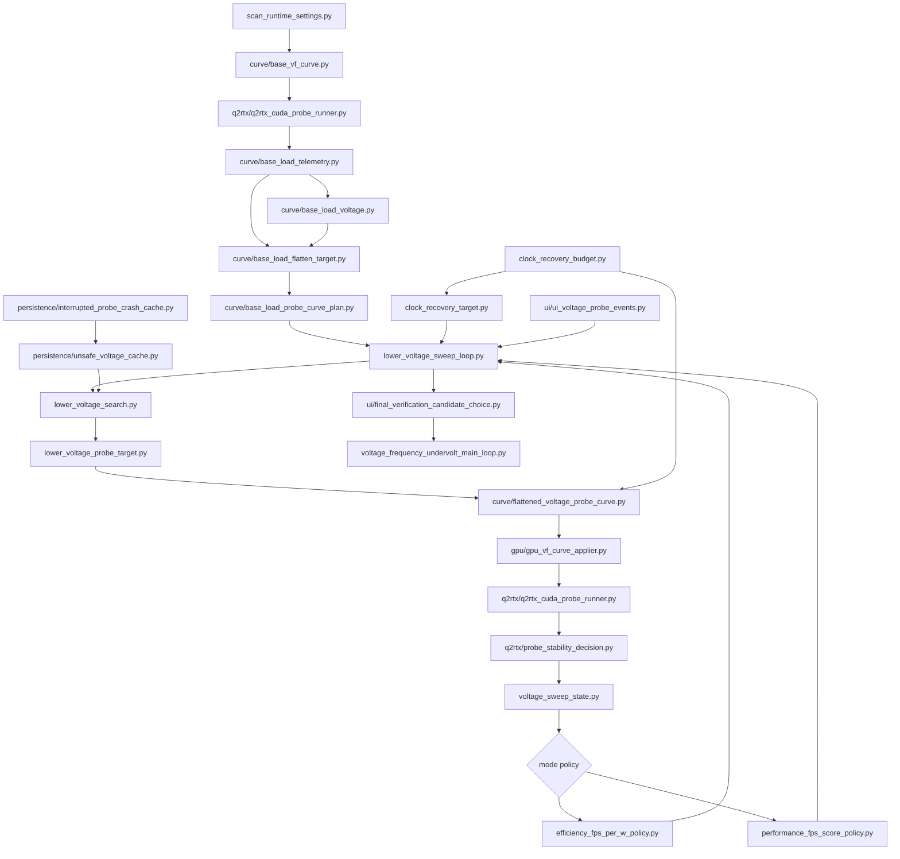

# Auto-UV3 Design Notes

This is the implementation plan for a human-forkable Auto-UV rewrite. The goal
is not a new tuning policy first. The goal is to make the existing policy legible
enough that a Python developer can change one rule without reading the whole
scanner.

Related detail docs:

- [Target frequency selection](auto-uv3-target-frequency.md)
- [Strict stability rules](auto-uv3-stability-rules.md)

## Design Rule

Each module should answer one question:

- What state are we in?
- What candidate do we probe next?
- What happened during the probe?
- What state transition follows?
- Which mode-specific policy can stop or recover the sweep?

No file should need to know the entire scanner.

## Size Budget

The old Auto-UV package is over 13K lines. Auto-UV3 must not become a line-for-line
rewrite. Sweeping a voltage/frequency curve down, recovering clock upward, testing
stability, and saving profiles is not simple, but it should still be explainable
as a small state machine with explicit rule modules.

Hard limits:

- No production module over 800 LOC.
- Preferred production module size is 50-250 LOC.
- The pure sweep loop should be under 300 LOC.
- Mode policy modules should be under 250 LOC each.
- Stability rule modules should be split by evidence type before any one file grows past 300 LOC.
- No compatibility shim may keep old behavior by hiding a large copy of old `auto_uv`.
- Every old behavior must be either ported as a named rule or explicitly rejected as dead, redundant, or contradictory.

## Proposed Package

```text
auto_uv3/
  __init__.py
  auto_uv_types.py
  auto_uv_scan_settings.py
  auto_uv_user_options.py
  scan_runtime_settings.py
  voltage_frequency_undervolt_main_loop.py

  lower_voltage_search.py
  lower_voltage_probe_target.py
  lower_voltage_sweep_loop.py

  clock_recovery_budget.py
  clock_recovery_target.py
  clock_recovery_backoff.py

  efficiency_fps_per_w_policy.py
  performance_fps_score_policy.py

  voltage_sweep_state.py

  curve/
    base_vf_curve.py
    base_vf_curve_voltage_bins.py
    base_vf_curve_validation.py
    base_load_telemetry.py
    base_load_voltage.py
    base_load_flatten_target.py
    base_load_probe_curve_plan.py
    vf_curve_flattening.py
    flattened_voltage_probe_curve.py
    measured_probe_lock_clock.py

  q2rtx/
    q2rtx_cuda_probe_runner.py
    q2rtx_cuda_voltage_probe.py
    q2rtx_cuda_probe_config.py
    q2rtx_live_abort_rules.py
    q2rtx_probe_summary.py
    probe_stability_decision.py
    probe_runtime_guardrails.py

  gpu/
    gpu_vf_curve_applier.py
    live_nvml_voltage_reader.py
    probe_clock_ceiling.py
    runtime_vf_offset_reset_check.py
    memory_clock_offset_user_option.py

  persistence/
    auto_uv_persisted_json_files.py
    unsafe_voltage_cache.py
    unsafe_voltage_blacklist_file.py
    interrupted_probe_crash_cache.py
    previous_crash_recovery_budget_limit.py
    verified_candidate_result_file.py
    probe_in_progress_marker_file.py

  ui/
    ui_json_event_writer.py
    ui_voltage_probe_events.py
    final_verification_candidate_choice.py
    probe_summary_ui_payload.py
    clock_recovery_budget_ui_payload.py
    vf_curve_ui_points.py

  recovery/
    baseline_upward_stabilization.py
    final_failure_upward_stabilization.py
```

## Module Chain



## Responsibility Split

| Module | Owns | Must not own |
| --- | --- | --- |
| `auto_uv_types.py` | Auto-UV dataclasses and enums | GPU calls, file IO |
| `auto_uv_scan_settings.py` | CLI/runtime option normalization for Auto-UV scans | Probe execution |
| `curve/base_vf_curve.py` | Base curve point model and lookups | Mode policy |
| `curve/base_vf_curve_voltage_bins.py` | Lower/higher editable voltage bin navigation | Target-clock math |
| `curve/base_vf_curve_validation.py` | Base curve sanity checks before scanning | Probe execution |
| `curve/base_load_telemetry.py` | Warmup filtering, saturated tail, and loaded-clock means | Stability policy |
| `curve/base_load_voltage.py` | Loaded voltage floor/average/ceiling during first load | Stability policy |
| `curve/base_load_flatten_target.py` | Proper base-load MHz selection for flattening | Probe execution |
| `curve/base_load_probe_curve_plan.py` | First load probe output to flatten target plus flattened plan | Candidate loop |
| `curve/vf_curve_flattening.py` | Flat plateau and below-lock ramp construction | Stability decisions |
| `curve/flattened_voltage_probe_curve.py` | Candidate voltage, target MHz, flattened plan, and label | Search policy |
| `lower_voltage_probe_target.py` | Lower-voltage target MHz and predicted clock-floor miss | Curve flattening |
| `lower_voltage_search.py` | Next lower voltage bin and skip/block decisions | Target-clock math |
| `q2rtx/probe_stability_decision.py` | Stable-run pass/fail decision from Q2RTX/CUDA/telemetry evidence | Voltage selection |
| `q2rtx/q2rtx_cuda_voltage_probe.py` | Apply one curve and run Q2RTX/CUDA with live guardrails | Sweep state |
| `q2rtx/q2rtx_live_abort_rules.py` | Live timedemo, load, clock, and stall abort rules | Candidate selection |
| `q2rtx/q2rtx_probe_summary.py` | Loaded probe summary metrics | Curve planning |
| `clock_recovery_budget.py` | Recovery budget math and labels | Candidate probing |
| `clock_recovery_target.py` | Recovery target MHz calculation | Efficiency/performance scoring |
| `clock_recovery_probe.py` | Retest same voltage with recovered clock target | FPS/W policy |
| `clock_recovery_backoff.py` | Step back a failed recovered clock target | Baseline selection |
| `efficiency_fps_per_w_policy.py` | FPS/W wall and confirmation policy | Performance scoring |
| `performance_fps_score_policy.py` | FPS-first score and best-candidate policy | FPS/W wall logic |
| `performance_voltage_recovery.py` | Sweep upward in voltage to recover performance | Generic sweep state |
| `voltage_sweep_state.py` | State transitions after probe decisions | Probe execution |
| `persistence/verified_candidate_result_file.py` | Latest/verified candidate JSON persistence | Algorithm policy |
| `ui/final_verification_candidate_choice.py` | Candidate ranking and UI/user final selection payloads | Probe execution |
| `ui/ui_voltage_probe_events.py` | GUI/json event payloads | Policy decisions |
| `auto_uv_console_log.py` | Human-readable Auto-UV log text | Algorithm decisions |
| `gpu/gpu_vf_curve_applier.py` | Apply/reset GPU V/F curve and clock ceiling | Algorithm policy |
| `q2rtx/q2rtx_cuda_probe_runner.py` | Run Q2RTX/CUDA and collect raw telemetry/output | Algorithm policy |
| `lower_voltage_sweep_loop.py` | Downward voltage sweep loop that keeps the last stable curve | GPU setup and final verification |
| `voltage_frequency_undervolt_main_loop.py` | Top-level V/F undervolt main loop: setup, base-load probe, sweep, final choice, final verification, cleanup | Individual sweep rules |

## Full Port Inventory

This is the list of current behavior that must be classified before old
`auto_uv` can be deleted. Each item is either ported, intentionally removed as
dead/redundant/contradictory, or blocked with a written reason.

### Hardware And Runtime Setup

- NVAPI V/F curve reader creation and failure reporting.
- NVML device handle creation, voltage reader availability, and cleanup.
- Runtime default reset before scan.
- Per-point V/F offset validation after defaults are restored.
- Power limit override and default power limit propagation.
- Memory clock V/F offset application and persistence into profiles.
- Clock ceiling/range lock around each probe.
- Signal/KeyboardInterrupt handling and last-stable snapshot.
- Q2RTX process cleanup before and after scans.

### Base Curve And Flattening

- Editable V/F point validation.
- Preserve-base-below-voltage behavior.
- Real voltage-bin navigation.
- Start voltage from loaded measured voltage, not only nominal base curve voltage.
- Proper target MHz calculation from loaded Q2RTX telemetry.
- Snap selected target down to the curve clock step.
- Build flat plateau at candidate voltage and above.
- Build ramp below candidate voltage instead of a cliff.
- Keep lower-than-lock points below the plateau cap.
- Normalize accepted curves to measured loaded voltage/clock after probing.

### Baseline And Target Clock

- Short default-curve discovery probe.
- Decision warmup filtering for telemetry samples.
- Saturated tail selection for settled high-load samples.
- Power-limit-saturated clock estimate.
- Active-power clock average.
- Active-power preferred percentile clock.
- Fallback to probe summary average only when better loaded estimates are missing.
- Choose the lowest credible loaded-clock estimate to avoid boost-spike flattening.
- Derive loaded voltage band and start from measured loaded voltage.
- Verify flattened baseline before descending.
- Search upward if the flattened baseline itself is unstable.

### Stability And Metrics

- Q2RTX process success checks.
- Timedemo frames/seconds/FPS parsing.
- Timedemo frame-count consistency.
- Timedemo FPS regression floors and streak rules.
- Warmup timedemo run exclusion in performance mode.
- CUDA companion workload success.
- Fatal Q2RTX output parsing.
- Fatal CUDA output parsing.
- NVIDIA Xid detection.
- Live telemetry load-lost detection.
- Live core-clock floor detection.
- Average busy core-clock floor detection.
- Stall detection when Q2RTX stops producing progress while GPU is not busy.
- Strict handling for missing or invalid metrics.

### Sweep And Recovery

- Lower-voltage candidate picking.
- Candidate phase labels.
- Unsafe-cache candidate blocking.
- Predicted clock-floor miss from recent accepted slope.
- Persistent clock-recovery budget across lower-voltage probes.
- Preemptive overclock when the next point is predicted to miss the floor.
- Iterative low-clock recovery while budget remains.
- Backoff after a hard failure at an overclocked target.
- Upward voltage recovery after hard failures.
- Stop on critical failure while keeping previous stable curve.
- Accept lowest floor miss only when budget is spent and failure is controlled.
- Write latest verified result after every accepted short probe.

### Mode Policies

- Efficiency FPS/W delta using temperature-normalized power.
- Efficiency no-gain streak and pending previous candidate.
- Minimum voltage drop before efficiency-wall stop.
- Efficiency wall overclock attempt before stopping.
- Performance score that heavily weights FPS and lightly weights FPS/W.
- Performance best-candidate tracking.
- Performance no-score-gain exploration window.
- Performance overclock step cap.
- Performance upward voltage recovery before final stop.
- Skip already-visited voltage/clock/memory points during performance recovery.

### Persistence And UI Contracts

- Probe-in-progress marker write and clean removal.
- Stale marker crash-cache validation.
- Persistent unsafe voltage JSON entries.
- Recovery-budget cap from previous recovery crash markers.
- Latest verified JSON payload.
- Verified candidates JSON payload.
- Final choice request/response payloads.
- Final profile archive payloads.
- Fan curve payload attachment to final profiles.
- JSON event stream for GUI scan progress.
- User-readable stage, candidate, and final summary text.
- Stdout/stderr debug log capture.

## Core Data Model

Use explicit names instead of the current mixed "clock bump", "overclock", and
"recovery" vocabulary.

```python
ScanSettings
BaseCurve
CurveCandidate
ProbeSummary
ProbeOutcome
StableRunDecision
SweepState
OverclockBudget
ProbeDecision
ModeDecision
SweepResult
UnsafePoint
```

Important state fields:

- `stable_voltage_mv`
- `stable_target_mhz`
- `stable_measured_mhz`
- `next_voltage_mv`
- `overclock_budget`
- `persistent_recovery_pct`
- `fixed_full_budget_target_mhz`
- `unsafe_points`
- `stable_history`
- `probe_history`

## Algorithm Verbs

These should become readable function names:

- `measure_stock_baseline`
- `parse_timedemo_metrics`
- `classify_q2rtx_cuda_driver_failures`
- `evaluate_stable_run`
- `choose_start_lock`
- `choose_loaded_target_clock`
- `flatten_curve`
- `pick_lower_voltage`
- `choose_candidate_target`
- `build_candidate_curve`
- `predict_clock_floor_miss`
- `apply_persistent_recovery`
- `spend_recovery_budget`
- `probe_candidate`
- `classify_probe`
- `accept_candidate`
- `recover_upward`
- `stop_at_efficiency_wall`
- `stop_at_performance_wall`
- `verify_final_curve`
- `record_unsafe_point`
- `restore_runtime_defaults`

## Shared Sweep Pseudocode

```python
while state.next_voltage_mv is not None:
    candidate = lower_voltage_search.next_candidate(state, base_curve, unsafe_cache)
    if candidate is blocked:
        state = state.skip_blocked_voltage(candidate)
        continue

    raw_probe = q2rtx_cuda_probe_runner.run(candidate)
    decision = probe_stability_decision.evaluate(raw_probe, state)

    if decision == TRY_OVERCLOCK:
        state = overclock_recovery.try_until_stable_or_spent(state, candidate)
        continue

    if decision == RECOVER_UPWARD:
        state = recover_upward_or_stop(state, candidate, probe)
        continue

    if decision == STOP_CRITICAL:
        return keep_previous_stable(state)

    state = sweep_state.apply(decision, candidate, probe)
    mode_decision = mode.after_accept(state)
    if mode_decision.should_stop:
        return mode_decision.result
```

## Efficiency Mode Pseudocode

```python
delta = efficiency_delta(previous_probe, stable_probe)
if delta.improved:
    reset_no_gain_tracking()
    continue

arm_previous_curve_as_stop_candidate()

if voltage_drop_is_too_small:
    continue

if overclock_budget_remains:
    if overclock_probe_improves_efficiency:
        accept_overclocked_curve()
        continue

if confirmation_streak_reached and budget_spent:
    stop_at_previous_curve_unless_delta_is_tiny_non_negative()
```

## Performance Mode Pseudocode

```python
score = performance_score(stable_probe, base_probe)
if score beats_best:
    record_best()
    continue

count_no_score_gain()

if budget_remains:
    if overclock_probe_beats_current_score:
        accept_overclocked_curve()
        continue
    if overclock_probe_hard_failed:
        sweep_higher_voltage_recovery()
        stop()

if enough_exploration and too_many_no_gain_steps:
    sweep_higher_voltage_recovery()
    stop_at_recovered_or_best()
```

## Rules That Must Survive The Rewrite

- No behavior from current `auto_uv` is dropped unless it is proven dead,
  redundant, or contradictory in this document or a test.
- Stable-run classification is centralized in `probe_stability_decision.py`.
- Q2RTX output, CUDA output, timedemo metrics, telemetry, fatal patterns, and
  Xid signals must all be considered before accepting a voltage point.
- Probe lower real editable V/F voltage bins, not arbitrary voltages.
- Flatten the candidate curve at the target clock.
- Save the latest short verified curve after every accepted candidate.
- Normalize accepted candidates to measured loaded clock when appropriate.
- Measure FPS, power, temperature, fan speed, voltage, and loaded core clock.
- Treat low loaded clock as recoverable with overclock budget.
- Treat CUDA/Q2RTX/stall/regression failures as upward-recovery candidates.
- Treat fatal output, Xid, load lost, invalid timedemo, and timeouts as critical.
- Persist unsafe voltage/clock bands across runs.
- Leave a crash marker during dangerous probes and consume it on the next run.
- Cap future recovery budget if a previous recovery probe crashed.
- Let efficiency mode stop on confirmed FPS/W wall.
- Let performance mode stop on FPS-first score wall.
- Let performance mode sweep back upward in voltage before final stop.
- Keep final long verification separate from the short candidate sweep.
- Restore runtime defaults and reset clock locks on cleanup.

## Legacy Complexity Hotspots

- The deleted legacy scan module owned setup, baseline, settings, recovery limit parsing, and final handoff.
- `live_sweep.py` mixes live GPU side effects, event emission, logging, and hook construction.
- `performance.py` owns both scoring policy and extra probing behavior.
- Probe failure reasons are strings; this makes transitions easy to mistype.
- "clock bump", "overclock", and "recovery" name the same family of behavior.
- Unsafe cache rules are partly in planning, artifacts, and probe runner modules.
- Candidate acceptance can mean requested target or measured target depending on context.

## Simplification Targets

- Split baseline run, target-frequency selection, and flattening into separate modules.
- Split Q2RTX/CUDA/timedemo/output-pattern stability checks into explicit rule files.
- Replace string probe actions with enums.
- Replace free-form failure prefix checks with a typed `FailureKind`.
- Move all unsafe-cache read/write/block logic behind one interface.
- Move crash marker validation out of artifact serialization.
- Keep all budget math in `clock_recovery_budget.py`.
- Make performance voltage recovery a mode plugin, not special code inside the generic loop.
- Make every sweep transition return a single `Transition` object with state, events, and side effects.
- Keep `gpu_vf_curve_applier.py` and `q2rtx_cuda_probe_runner.py` as the only modules allowed to touch GPU state or run workloads.

## Testing Plan

- Unit-test `base_load_flatten_target.py` with noisy ramp-up, active-load, saturated-tail, and fallback-only telemetry.
- Unit-test `vf_curve_flattening.py` for plateau, ramp, preserved base points, and editable-bin validation.
- Unit-test `probe_stability_decision.py` with Q2RTX output, CUDA output, missing metrics, Xid, low-clock, load-lost, and clean-pass fixtures.
- Unit-test `lower_voltage_search.py` with synthetic curves and unsafe-cache entries.
- Unit-test `flattened_voltage_probe_curve.py` for labels and flattened plan handoff.
- Unit-test `probe_stability_decision.py` with typed failure kinds.
- Unit-test `voltage_sweep_state.py` transitions without GPU calls.
- Unit-test `clock_recovery_budget.py` for budget spend, persistent recovery, and full-budget target fixing.
- Unit-test `efficiency_fps_per_w_policy.py` with FPS/W deltas and confirmation streaks.
- Unit-test `performance_fps_score_policy.py` with score sequences and upward voltage recovery.
- Integration-test `lower_voltage_sweep_loop.py` with fake Q2RTX/CUDA probe results.
- Keep live GPU tests opt-in behind explicit local developer commands.

## Implemented Module Chain

1. `auto_uv3/voltage_frequency_undervolt_main_loop.py` owns setup, base-load probe, lower-voltage sweep, final choice, final verification, and cleanup.
2. `auto_uv3/curve/` owns base V/F curve parsing, loaded telemetry, target-clock selection, and flattening.
3. `auto_uv3/q2rtx/` owns Q2RTX/CUDA probe config, live workload execution, telemetry parsing, and stable-run decisions.
4. `auto_uv3/recovery/` owns upward clock recovery, crash-limited recovery budget, and final-failure stabilization.
5. `auto_uv3/scan_mode/` owns efficiency and performance scoring policy.
