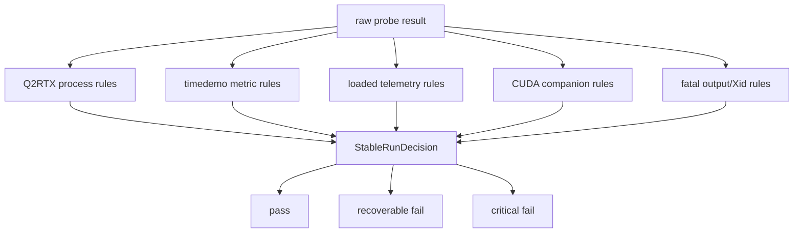

# Auto-UV3 Stability Rules

Auto-UV3 treats stability as a dedicated rule engine. The sweep should not parse
Q2RTX output, CUDA output, timedemo runs, or telemetry directly.

The proposed pure module is:

```text
auto_uv/probe_stability_decision.py
```

## Stable Pass Definition

A voltage point passes only when all required evidence passes:

- Q2RTX process result is successful.
- Timedemo frames/seconds/FPS are present and positive.
- Timedemo frame count matches the baseline unless the workload intentionally changed.
- Average timedemo FPS stays within 10% of the accepted baseline.
- Each individual timedemo run stays within 20% of the accepted baseline.
- Telemetry proves the GPU was busy under real load.
- Busy core clock stays above the configured floor.
- CUDA companion workload passes when enabled.
- Fatal Q2RTX/CUDA output patterns are absent.
- NVIDIA Xid signals are absent.
- No user stop request occurred.

Missing required evidence fails closed. It should not be accepted just because
the process returned.

## Failure Classes

```text
PASS
RECOVERABLE
UNSAFE
CRITICAL
```

Recoverable examples:

- low loaded core clock with otherwise valid workload
- FPS regression without fatal output
- Q2RTX/CUDA failure where higher voltage may stabilize and no driver-fatal signal appeared

Critical examples:

- NVIDIA Xid
- fatal Q2RTX output
- fatal CUDA output
- invalid or missing timedemo metrics
- timedemo timeout
- load lost while workload should be busy

## Rule Components



## Code Comment Requirement

The code should have short comments around each rule family explaining the
hardware-safety reason:

- Q2RTX success alone is not enough.
- Timedemo metrics prove the FPS result.
- Low clock can be recoverable through overclock budget.
- CUDA failure invalidates the whole probe when CUDA is enabled.
- Missing metrics fail closed.
- Xid and fatal output bypass normal recovery.
