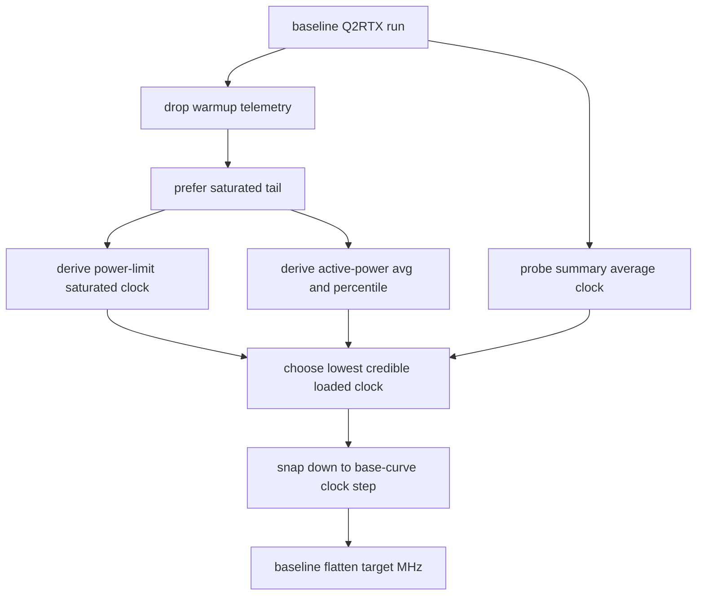

# Auto-UV3 Target Frequency Selection

Auto-UV does not flatten the curve at the advertised max boost clock. It first
measures what the GPU actually sustains under Q2RTX load, then flattens to a
safe clock at or below that measured value.

## Input

The target-frequency module uses:

- the base V/F curve
- Q2RTX telemetry samples from the baseline/default-curve probe
- optional power limit
- fallback average core clock from the probe summary

## Rule

Use only loaded samples when possible. Idle/menu/ramp-up telemetry must not
decide the flatten clock.

The current logic preserves these estimates:

1. `saturated_clock_mhz`: average clock from samples near the power limit.
2. `active_avg_clock_mhz`: average clock from samples above the active power floor.
3. `active_preferred_clock_mhz`: percentile clock from active samples to avoid one-sample boost spikes.
4. `fallback_clock_mhz`: probe summary average, used only if better loaded estimates are missing.

The chosen measured clock is the lowest credible value from those estimates.
That is intentional: it avoids building a flattened curve that asks the GPU to
hold a transient boost clock it did not actually sustain.

## State Machine

## Code Placement

In `auto_uv`, this belongs in:

- `base_load_telemetry.py`: warmup filtering, saturated tail, active samples
- `base_load_flatten_target.py`: choose the measured target MHz and snap it down
- `base_load_probe_curve_plan.py`: connect the first load probe output to flattening

The deleted legacy implementation spread this across scan, probe metrics, and
curve-planning modules. Auto-UV3 keeps those as separate concepts.
