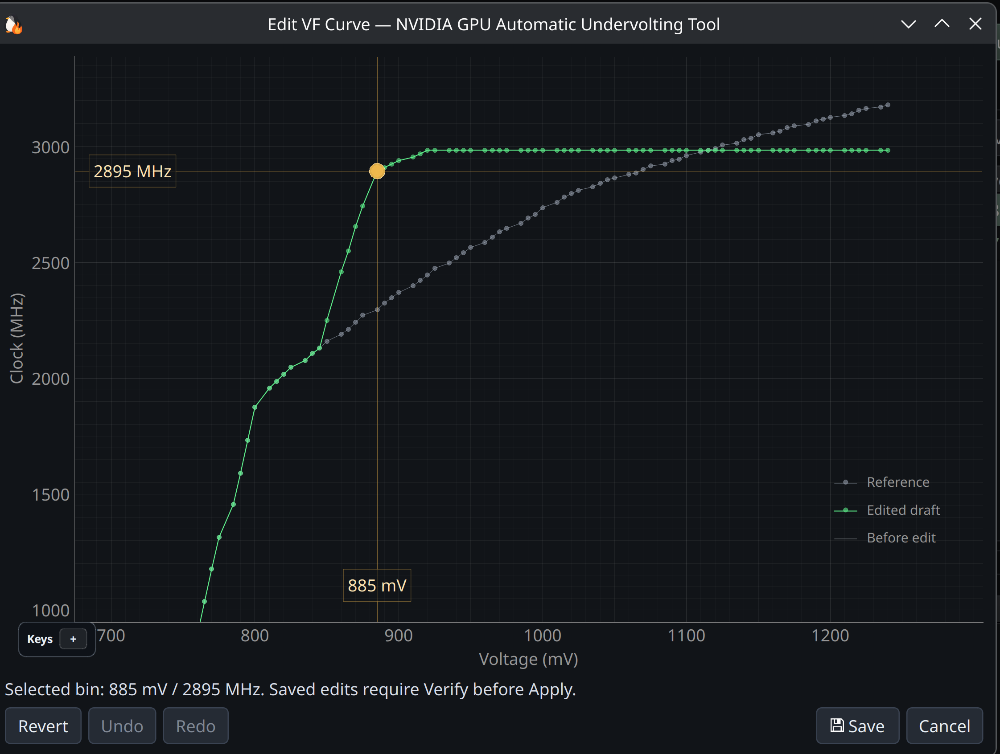
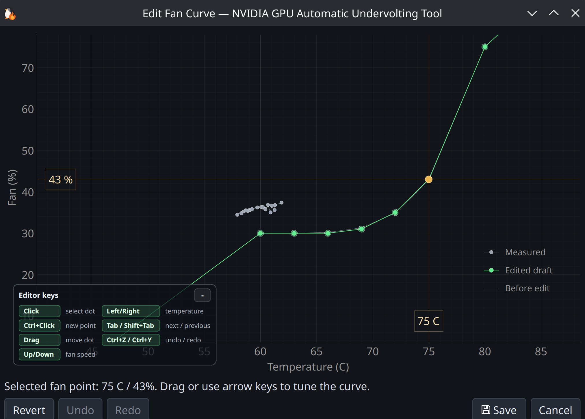

# Curve Editors

> Feature guide — see the [README](../../README.md) for the project overview.

PenguinBurner ships an Afterburner-style manual editor for both the
voltage/frequency curve and the fan curve, with full keyboard control. Open
either from the **Profiles** tab (right-click → Edit VF Curve / Edit Fan Curve).

## VF curve editor

Tune the GPU clock at each voltage bin. Three traces are drawn:

- **Reference** — the stock/default curve.
- **Edited draft** — your in-progress changes (green).
- **Before edit** — the curve as it was when you opened the editor.

Pick a bin (e.g. `885 mV / 2895 MHz`), drag or use arrow keys to move it.
Edits must be **verified before they can be applied** — the status bar shows the
selected bin and verification state.

## Fan curve editor

Tune fan % against temperature with the same draft / before-edit / measured
traces. Measured points show your card's real behavior so you can shape a curve
around it.

## Editor keys

| Key | Action |
| --- | --- |
| Click | Select point |
| Ctrl+Click | Add point |
| Drag / Arrows | Move point |
| Left / Right | Move along temperature/voltage |
| Up / Down | Adjust fan speed / clock |
| Tab / Shift+Tab | Next / previous point |
| Ctrl+Z / Ctrl+Y | Undo / redo |

**Revert**, **Undo**, **Redo**, **Save**, and **Cancel** are available at all times.
