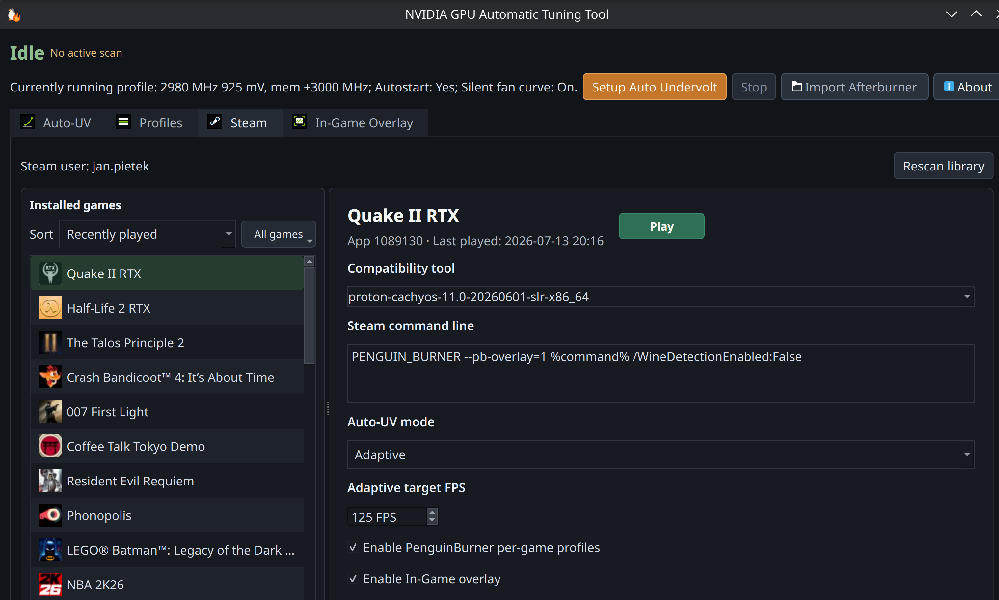

# Steam Integration

PenguinBurner's **Steam** tab turns undervolting into per-game automation:
discover your installed library, pick how the GPU should behave for each game,
and let PenguinBurner apply it automatically when that game launches — no manual
profile switching.



## Why it matters

The system-wide profile is one setting for everything. Steam integration lets a
single library hold **different behavior per game**: a light indie title runs
dead-silent on Efficiency while a demanding shooter gets Performance or adapts
live. It is also the only way to get the **adaptive, per-game pre-frame-generation
FPS target** (below) and the in-game overlay, because both are delivered through
the launch wrapper.

## Setup (one scan of your library)

1. Open the **Steam** tab. If PenguinBurner has not seen your library yet, click
   **Scan my Steam library**. This is safe and non-destructive: every game is
   listed, all left **disabled**, and no launch options are changed.
2. Restart Steam once if prompted (this connects live apply).
3. Select a game and toggle **Enable PenguinBurner per-game profiles**. Only then
   does PenguinBurner add its launch-options wrapper to that one game.

Nothing is forced. Enablement is strictly per game and per Steam account, stored
in `~/.config/PenguinBurner/steam-game-settings.json`.

## Per-game options

The per-game editor exposes:

- **Compatibility tool** — Steam's current per-game override, or its effective
  default Proton when no override was saved. PenguinBurner reads the effective
  tool from Steam's live per-app details API; it does not infer "native" from a
  missing config entry. Only games Steam explicitly reports as native Linux
  have this selector disabled and visibly grayed out.
- **Auto-UV mode** — one of:
  - **Adaptive** — starts from your newest profile and switches between saved
    tiers using live present-frame pacing (see below).
  - **Efficiency / Balanced / Performance** — pin one saved tier for this game.
  - **Stock (factory GPU state)** — run this game at the factory curve while your
    system-wide profile stays tuned.
- **Adaptive target FPS** — the per-game base-present FPS the adaptive engine
  aims for (15–1000, default 60). It decides when to promote toward more clock or
  demote toward more efficiency. This is **per game**, so a 60 Hz story game and a
  144 Hz competitive shooter each get their own target.
- **Enable In-Game overlay** — the live readout (latency, pre-frame-gen FPS,
  clocks, power, tier) for this game.

The tuning and overlay controls stay grayed out until the game's PenguinBurner
toggle is on. The compatibility selector is independent of that toggle; it is
grayed out only for a Steam-confirmed native Linux runtime or when live Steam
control is unavailable.

## Bulk actions ("All games")

Next to the library sort control, the **All games** menu applies an action across
your whole library in one confirmed step:

- **Enable / Disable PenguinBurner for all games** — add or remove the wrapper
  everywhere. Enabling keeps the overlay off and leaves each game's saved mode
  intact; disabling restores every game's original Steam launch options.
- **Show / Hide In-Game overlay for enabled games.**

Each action confirms first and shows the game count. Directions that would change
nothing (for example "enable all" when everything is already enabled) gray out, so
the menu doubles as a state readout. Bulk enable also spells out its two side
effects: the overlay stays off, and MangoHud is disabled inside wrapped games.

## Play / Stop

The per-game editor's button is a single Steam-style control that reflects the
live session: green **Play** → **Starting…** → red **Stop** while running →
**Stopping…** → back to Play. It can never be in a state that disagrees with the
game — transitional states are unclickable, and a launch or stop that stalls
always resolves back to a usable button.

## How it applies (no password prompts)

Enabling a game splices the `PENGUIN_BURNER` wrapper into its Steam launch
options. At launch the wrapper resolves the game and account, then asks the
already-root daemon to apply that game's profile over the socket — no elevation,
no per-game password. When the game exits, the daemon restores your standing
profile automatically. If the daemon is unreachable, the wrapper soft-fails and
the game launches normally; PenguinBurner never blocks a launch.

Adaptive mode additionally passes the per-game target FPS, and a live change to
a running game is re-applied in place without a relaunch.

## Compatibility

- The **GPU profile** (undervolt, clocks, power, adaptive tiers) is graphics-API
  agnostic: native Linux, every Proton version, and DirectX 8–12 all work.
- The **overlay and frame-pacing telemetry** are a Vulkan layer, so they cover
  anything presenting through Vulkan (DXVK for DX8–11, vkd3d-proton for DX12,
  native Vulkan). Native OpenGL titles get the profile but no overlay, and
  adaptive mode simply holds its initial tier when there is no present-pacing
  signal to react to.

## Manual launch options

You do not have to use the tab — the wrapper works from any launch-options
string:

```text
PENGUIN_BURNER %command%
```

Add the overlay flag to show the readout immediately:

```text
PB_OVERLAY=1 PENGUIN_BURNER %command%
```

See the [overlay guide](features/overlay.md) and
[latency / frame-generation FPS](features/latency-fg.md) for the overlay's
sources and fallbacks.
